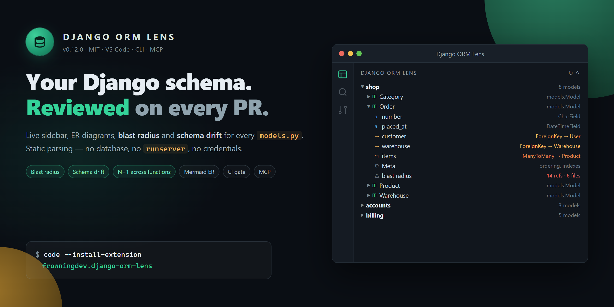

<div align="center">



<br/>
<br/>

# Django ORM Lens

### See your entire Django schema — in your editor, in your terminal, and from your AI agent.

Every app. Every model. Every field. Every relationship. Grouped, navigable, and one keystroke away from a live ER diagram.

<br/>

[](https://marketplace.visualstudio.com/items?itemName=frowningdev.django-orm-lens)
[](https://pypi.org/project/django-orm-lens/)
[](https://registry.modelcontextprotocol.io/)
[](https://glama.ai/mcp/servers/FROWNINGdev/django-orm-lens)
[](https://mcp.so/servers/django-orm-lens)
[](https://github.com/FROWNINGdev/django-orm-lens)
[](https://github.com/sponsors/FROWNINGdev)

<br/>

[](https://marketplace.visualstudio.com/items?itemName=frowningdev.django-orm-lens)
[](https://marketplace.visualstudio.com/items?itemName=frowningdev.django-orm-lens)
[](https://marketplace.visualstudio.com/items?itemName=frowningdev.django-orm-lens&ssr=false#review-details)
[](https://pypi.org/project/django-orm-lens/)
[](https://pypi.org/project/django-orm-lens/)
[](LICENSE)
[](https://github.com/FROWNINGdev/django-orm-lens/actions/workflows/ci.yml)

</div>

---

## 🎯 Pick your path

Django ORM Lens ships as **three distributions on one core** — pick the one that matches your workflow. Each takes under 60 seconds.

**Editor user (VS Code / Cursor / Windsurf):** install the extension → open any Django project → sidebar tree + ER diagram appear.

```bash
code --install-extension frowningdev.django-orm-lens
```

**Terminal / CI user:** install from PyPI → run `django-orm-lens` in any directory that contains Django apps.

```bash
pip install django-orm-lens
django-orm-lens               # welcome + commands
django-orm-lens scan          # scan cwd for apps and models
```

**AI coding agent user (Cursor / Aider / Continue / Zed):** install with MCP extras → add one JSON block to your client config.

```bash
pip install "django-orm-lens[mcp]"
```

Then the MCP config snippet in the [Integrations](#-integrations) section below. Point `DJANGO_ORM_LENS_ROOT` at your Django project's absolute path.

---

## 📊 Traction

<div align="center">

<!-- Headline split-badges (dark label · colored value) -->

[](https://pypi.org/project/django-orm-lens/)
[](https://pypi.org/project/django-orm-lens/)
[](https://github.com/FROWNINGdev/django-orm-lens)
[](https://marketplace.visualstudio.com/items?itemName=frowningdev.django-orm-lens)

<br/>

<!-- Cross-platform reach snapshot -->

[](https://marketplace.visualstudio.com/items?itemName=frowningdev.django-orm-lens)
[](https://github.com/FROWNINGdev/django-orm-lens)
[](https://linkedin.com/company/django-orm-lens)
[](https://github.com/FROWNINGdev)

<br/>

<!-- Live counters + directories -->

[](https://pypi.org/project/django-orm-lens/)
[](https://pypi.org/project/django-orm-lens/)
[](https://github.com/FROWNINGdev/django-orm-lens/stargazers)
[](https://github.com/FROWNINGdev/django-orm-lens/network/members)

<br/>

<!-- MCP directories -->

[](https://registry.modelcontextprotocol.io/)
[](https://glama.ai/mcp/servers/FROWNINGdev/django-orm-lens)
[](https://mcp.so/servers/django-orm-lens)

<br/>

<!-- Tech stack + license -->

[](https://marketplace.visualstudio.com/items?itemName=frowningdev.django-orm-lens)
[](https://pypi.org/project/django-orm-lens/)
[](https://pypi.org/project/django-orm-lens/)
[](https://www.djangoproject.com/)
[](LICENSE)

</div>

<sub><i>Updated 2026-07-15. PyPI weekly / monthly, GitHub stars / forks, and PyPI / VS Code version badges auto-refresh live.</i></sub>

> If the tool saves you a `grep` next time you touch a strange Django project — **[star helps others find it](https://github.com/FROWNINGdev/django-orm-lens/stargazers)**.

---

## ⚡ Install

**VS Code / Cursor / Windsurf / any Code fork:**

```bash
code --install-extension frowningdev.django-orm-lens
```

Or search **`Django ORM Lens`** in the Extensions view.

**Terminal & AI coding agents:**

```bash
pip install django-orm-lens              # CLI only
pip install "django-orm-lens[mcp]"       # + MCP server for AI agents
```

Requires Python 3.9+. Zero runtime dependencies for the CLI.

<br/>

## 🎯 The problem

You open a Django project. It has 20 apps. You need to answer a simple question:

> _"Which app owns the `Order` model, and how is it connected to `User`?"_

Today, that means: `Ctrl+P`, "models", scroll through 30 hits, open five files, `Ctrl+F` for `class Order`, read through 400 lines of `ForeignKey('otherapp.Something')` strings, try to remember what you learned two files ago.

**Half a day gone. Every time. On every project.**

<br/>

## ✨ With Django ORM Lens

<table>
<tr>
<td width="50%" valign="top">

### 📚 A tree of everything

Every app → every model → every field → every `Meta` option. Grouped by application, sorted alphabetically, expandable.

Icons distinguish `CharField` from `ForeignKey` from `ManyToManyField` at a glance.

</td>
<td width="50%" valign="top">

### 🕸️ A live ER diagram

One command opens a Mermaid entity-relationship diagram of your entire schema. Watch it redraw as you edit. Export to SVG.

`ForeignKey`, `OneToOneField`, and `ManyToManyField` become proper cardinality arrows.

</td>
</tr>
<tr>
<td width="50%" valign="top">

### 🔎 Hover for relations

Hover over `ForeignKey('app.Model')` in any Python file → a card pops up with the target model's fields, relations, and a "Jump to" link. No `Ctrl+F`, no file dialog.

</td>
<td width="50%" valign="top">

### 🧭 Jump-to-definition

Click any field in the tree → cursor lands on the exact line. Filter the tree by app or model name. Split `models/` packages are fully supported.

</td>
</tr>
<tr>
<td width="50%" valign="top">

### ⚡ Zero configuration

No `DJANGO_SETTINGS_MODULE`. No `runserver`. Parses `models.py` statically. Works with a broken venv, a missing dependency, or on someone else's laptop.

</td>
<td width="50%" valign="top">

### 🎨 Native VS Code UI

Dark theme. Light theme. Your theme. Follows your icon theme, your font, your key bindings. Nothing garish, nothing branded.

</td>
</tr>
</table>

<br/>

## 📸 What it looks like

<div align="center">

</div>

**Also included in the extension:**

- 🕸️ **Live ER diagram** — Mermaid cardinality arrows, edge labels (`CASCADE`, `through Model`, `as related_name`), theme-aware, one-click SVG export
- 🔎 **Hover cards** — over any `ForeignKey('app.Model')` or `ManyToManyField(...)`, with a one-click jump link
- 🧭 **CodeLens** — above every `class Model` line: field count, relation count, and an **Open ER diagram** action
- 🎨 **Named themes** — `auto` / `default` / `dark` / `forest` / `neutral` for the diagram webview

<br/>

## 🤖 For terminals and AI coding agents

The same parser that powers the VS Code extension ships as a standalone Python package — with an optional **MCP (Model Context Protocol) server** so any MCP-compatible AI agent can navigate your Django schema without importing Django or booting your app.

### CLI

```bash
django-orm-lens scan -f json          # every app, every model, every field
django-orm-lens describe blog.Post    # one model in Markdown
django-orm-lens hover blog.Post       # compact hover card
django-orm-lens list | fzf            # flat app.Model — pipes anywhere
django-orm-lens er > schema.mmd       # Mermaid ER diagram
```

Every command accepts `--path <dir>` and `--exclude <glob>`.

### MCP server

Register it once with your agent and it exposes five read-only tools:

| Tool | Purpose |
| --- | --- |
| `list_apps` | Every Django app in the workspace with model counts |
| `list_models` | Flat `app.Model` list, optional app filter |
| `describe_model` | Full field / relation / Meta detail for one model |
| `find_relations` | Inbound + outbound relations for one model |
| `er_diagram` | Mermaid `erDiagram` for the whole workspace |

```bash
# Start it directly
django-orm-lens-mcp

# Or via the CLI subcommand
django-orm-lens mcp
```

Set `DJANGO_ORM_LENS_ROOT=/abs/path/to/project` to point it anywhere.

<br/>

## 🔌 Integrations

| Client | How to enable | Status |
|---|---|:-:|
| **VS Code** | `code --install-extension frowningdev.django-orm-lens` | ✅ |
| **Cursor** | same VSIX + optional MCP entry in `~/.cursor/mcp.json` | ✅ |
| **Windsurf / VSCodium / any Code fork** | install the VSIX from the [Marketplace](https://marketplace.visualstudio.com/items?itemName=frowningdev.django-orm-lens) or [GitHub Releases](https://github.com/FROWNINGdev/django-orm-lens/releases) | ✅ |
| **Aider** | add `django-orm-lens-mcp` to your `mcp.json` | ✅ (via MCP) |
| **Continue.dev** | register the MCP server in `~/.continue/config.json` | ✅ (via MCP) |
| **Zed** | register the MCP server in Zed settings | ✅ (via MCP) |
| **Any MCP-compatible client** | point `command` at `django-orm-lens-mcp`, set `DJANGO_ORM_LENS_ROOT` | ✅ |
| **Discoverable via [MCP Registry](https://registry.modelcontextprotocol.io/)** | official Model Context Protocol server directory | ✅ |
| **Plain terminal / CI** | `pip install django-orm-lens && django-orm-lens scan` | ✅ |

### Example: Cursor / any MCP client

```jsonc
{
  "mcpServers": {
    "django-orm-lens": {
      "command": "django-orm-lens-mcp",
      "env": { "DJANGO_ORM_LENS_ROOT": "/abs/path/to/your/project" }
    }
  }
}
```

<br/>

## 🚀 Get started (30 seconds)

**In VS Code:**

1. `code --install-extension frowningdev.django-orm-lens`
2. Open a folder with a `manage.py` or `models.py`
3. Click the **Django ORM Lens** icon in the activity bar
4. Expand apps → models → fields
5. Click the **type-hierarchy** icon at the top of the panel → ER diagram opens beside your code

**In a terminal:**

```bash
pip install django-orm-lens
cd my-django-project
django-orm-lens scan -f table
```

**As an AI agent tool:**

```bash
pip install "django-orm-lens[mcp]"
```

…then register `django-orm-lens-mcp` in your agent's MCP config (see the [Integrations](#-integrations) table above).

No settings screen. No sign-in. No telemetry.

<br/>

## 🎯 Who this is for

- **Django developers** joining a codebase with 10+ apps and getting lost in `models.py` sprawl.
- **Contract / freelance engineers** who need to grasp an unfamiliar Django project in the first hour, not the first week.
- **Teams onboarding new hires** who want a one-glance schema view without spinning up documentation infrastructure.
- **AI-agent power users** (Cursor / Aider / Claude Desktop / Zed / Continue) who need the agent to answer schema questions accurately — without giving it database credentials or booting Django.
- **CI pipelines** that verify schema shape (e.g. "did we accidentally break a `related_name`?") without importing the project.
- **Solo indie devs** on a broken venv or someone else's laptop — no `runserver`, no `manage.py migrate`, still works.

<br/>

## 🗺️ Market position

Django ORM Lens sits at the intersection of **editor tooling** and **AI-agent tooling** — a slot no existing package covers:

| Segment | Existing option | What it costs you |
|---|---|---|
| Boot-and-graph | `django-extensions graph_models` | Requires Graphviz + Django settings + a working DB URL |
| Web-based viewer | `django-schema-graph` | Requires a running Django server; hosts one more thing to break |
| Admin panel | Django Admin | Requires runserver + auth + database — great for data, not for architecture |
| Editor plugin | PyCharm's Django Structure | Locked to PyCharm; no CLI, no AI-agent story |
| MCP server | (none until now) | AI agents guess your schema from source, imperfectly |

**Django ORM Lens is the only tool that ships three surfaces from one parser:** a VS Code extension (any Code fork), a zero-dep CLI (terminals + CI), and an MCP server (AI agents). All static. All free. All MIT.

<br/>

## 🤔 How is this different?

| | **Django ORM Lens** | `django-extensions graph_models` | `django-schema-graph` | Django Admin | PyCharm Django Structure |
|---|:-:|:-:|:-:|:-:|:-:|
| Works without a bootable Django project | ✅ | ❌ | ❌ | ❌ | ⚠️ |
| Zero-install (no graphviz, no server) | ✅ | ❌ | ❌ | ❌ | ❌ (needs PyCharm) |
| Works in VS Code / Cursor / any Code fork | ✅ | ❌ | ❌ | ❌ | ❌ |
| Sidebar tree inside the editor | ✅ | ❌ | ❌ | ❌ | ✅ |
| Live ER diagram | ✅ | ✅ | ✅ | ❌ | ❌ |
| Hover cards on `ForeignKey` | ✅ | ❌ | ❌ | ❌ | ⚠️ |
| CodeLens on model classes | ✅ | ❌ | ❌ | ❌ | ❌ |
| Split `models/` package support | ✅ | ⚠️ | ⚠️ | ✅ | ✅ |
| CLI for terminal / CI | ✅ | ⚠️ | ❌ | ❌ | ❌ |
| MCP server for AI agents | ✅ | ❌ | ❌ | ❌ | ❌ |
| Discoverable in the [MCP Registry](https://registry.modelcontextprotocol.io/) | ✅ | ❌ | ❌ | ❌ | ❌ |
| Free & open-source (MIT) | ✅ | ✅ | ✅ | ✅ | ❌ (paid IDE) |

<br/>

## ⚙️ Configuration

The defaults are opinionated and sensible. If you need to tweak:

```jsonc
// .vscode/settings.json
{
  "djangoOrmLens.excludeGlobs": [
    "**/migrations/**",
    "**/node_modules/**",
    "**/venv/**",
    "**/.venv/**",
    "**/env/**"
  ],
  "djangoOrmLens.autoRefresh": true
}
```

| Setting | Type | Default | What it does |
|---|---|---|---|
| `djangoOrmLens.excludeGlobs` | `string[]` | See above | Glob patterns to skip when scanning |
| `djangoOrmLens.autoRefresh` | `boolean` | `true` | Rescan on `models.py` changes |

<br/>

## 🧭 Commands

Open the command palette (`Ctrl+Shift+P` / `Cmd+Shift+P`) and type "Django ORM Lens":

| Command | What it does |
|---|---|
| `Django ORM Lens: Refresh` | Force-rescan the workspace |
| `Django ORM Lens: Show ER Diagram` | Open the Mermaid ER diagram side-by-side |
| `Django ORM Lens: Filter Models` | Filter the tree by app / model / field name |
| `Django ORM Lens: Clear Filter` | Restore the full tree |
| `Django ORM Lens: Jump to Model` | Programmatic — triggered by tree clicks and hover cards |

<br/>

## 🗺️ Roadmap

**Shipped**

- [x] Sidebar tree grouped by app
- [x] Live Mermaid ER diagram
- [x] Hover cards over `ForeignKey('app.Model')`
- [x] Filter tree by name
- [x] Split `models/` package support
- [x] Export ER diagram as SVG
- [x] Python CLI + MCP server for terminals and AI agents
- [x] Welcome view for empty workspaces
- [x] Path-safe jump-to-definition and sanitized hover markdown
- [x] **v0.3.0** — CodeLens above each model class (`N fields · N relations · Open ER diagram`)
- [x] **v0.3.0** — Edge labels on the diagram (`CASCADE`, `SET_NULL`, `PROTECT`, `related_name`)
- [x] **v0.3.0** — Named color themes (`auto` / `default` / `dark` / `forest` / `neutral`)
- [x] **v0.3.1** — `through_model` on M2M edges (contributed by [@kingrubic](https://github.com/kingrubic))
- [x] **v0.3.1** — Listed in the [official MCP Registry](https://registry.modelcontextprotocol.io/) + [Glama.ai](https://glama.ai/mcp/servers/FROWNINGdev/django-orm-lens)

**Next**

- [ ] Zoom + minimap + auto-layout inside the webview ([#4](https://github.com/FROWNINGdev/django-orm-lens/issues/4))
- [ ] ORM query autocomplete inside `.filter()` / `.exclude()` / `.annotate()` ([#3](https://github.com/FROWNINGdev/django-orm-lens/issues/3))
- [ ] App / model toggle checkboxes to declutter huge schemas

**Later**

- [ ] Migration dependency graph
- [ ] Third-party field support (`django-mptt`, `django-taggit`, `django-model-utils`)
- [ ] JetBrains / PyCharm plugin (if there is demand)

Vote by 👍-ing the corresponding [issue](https://github.com/FROWNINGdev/django-orm-lens/issues).

<br/>

## ❓ FAQ

<details>
<summary><b>Do you send any of my code to a server?</b></summary>
<br/>
No. Every byte stays on your machine. The parser is pure TypeScript (extension) or pure Python (CLI). No LLM calls, no telemetry, no analytics, no error reporting. The Mermaid renderer runs inside VS Code's webview sandbox.
</details>

<details>
<summary><b>Does it work with Poetry / uv / conda / no venv at all?</b></summary>
<br/>
Yes. The extension reads Python source directly — it does not import Django and does not care what package manager you use. The CLI requires Python 3.9+, but that is it.
</details>

<details>
<summary><b>My models are split across multiple files inside a <code>models/</code> package. Does that work?</b></summary>
<br/>
Yes, since v0.2.0. Both the extension and the CLI walk <code>models/*.py</code> alongside classic <code>models.py</code>.
</details>

<details>
<summary><b>Can I use it with DRF serializers, Wagtail, Oscar, or third-party base models?</b></summary>
<br/>
Any class that looks like a Django model is picked up: subclasses of <code>models.Model</code>, abstract bases starting with <code>Abstract</code>, common mixins ending in <code>Mixin</code>, and known base names like <code>TimeStampedModel</code> or <code>PolymorphicModel</code>. Non-model classes (<code>ModelAdmin</code>, <code>ModelSerializer</code>, <code>Form</code>, <code>View</code>, <code>Manager</code>, …) are filtered out.
</details>

<details>
<summary><b>Which AI agents can use the MCP server?</b></summary>
<br/>
Any MCP-compatible client — Cursor, Aider, Continue.dev, Zed, and any other tool that speaks the protocol. Just point <code>command</code> at the installed <code>django-orm-lens-mcp</code> binary. See the <a href="#-integrations">Integrations</a> section.
</details>

<details>
<summary><b>Is there a JetBrains / PyCharm version?</b></summary>
<br/>
Not yet. PyCharm's Django Structure tool window is already good, so the value delta is smaller. If enough people ask, it becomes worth doing.
</details>

<br/>

## 🆘 Support

- 🐛 **Bug reports** — [GitHub Issues](https://github.com/FROWNINGdev/django-orm-lens/issues) (please include a minimal `models.py` snippet)
- 💡 **Feature requests / ideas** — [GitHub Discussions](https://github.com/FROWNINGdev/django-orm-lens/discussions)
- 📝 **Marketplace reviews** — [rate the extension](https://marketplace.visualstudio.com/items?itemName=frowningdev.django-orm-lens&ssr=false#review-details) (the fastest signal that keeps this project moving)
- 🐍 **PyPI page** — [pypi.org/project/django-orm-lens](https://pypi.org/project/django-orm-lens/)
- 💚 **Sponsor** — [github.com/sponsors/FROWNINGdev](https://github.com/sponsors/FROWNINGdev)

<br/>

## 📜 License

MIT © [FROWNINGdev](https://github.com/FROWNINGdev)

<br/>

<div align="center">

**Made for developers who care about their codebase.**

[Marketplace](https://marketplace.visualstudio.com/items?itemName=frowningdev.django-orm-lens) · [PyPI](https://pypi.org/project/django-orm-lens/) · [GitHub](https://github.com/FROWNINGdev/django-orm-lens) · [Issues](https://github.com/FROWNINGdev/django-orm-lens/issues) · [Discussions](https://github.com/FROWNINGdev/django-orm-lens/discussions) · [Sponsor](https://github.com/sponsors/FROWNINGdev)

</div>
