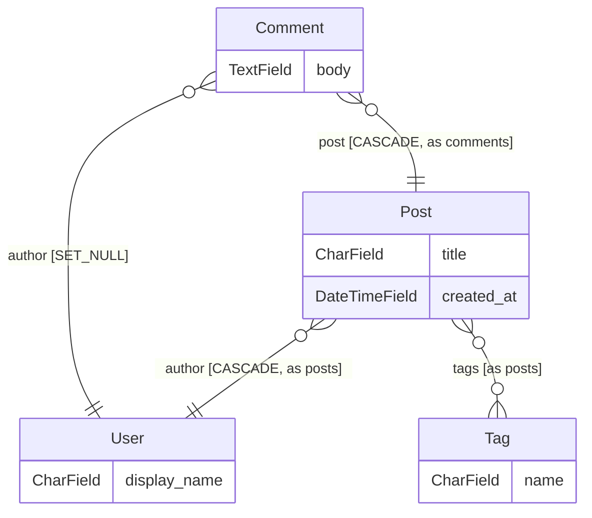

[English](../../README.md) · [Русский](README.ru.md) · **Español** · [中文](README.zh.md)

<div align="center" markdown="1">


<br/>
<br/>

# Django ORM Lens

### La capa de inteligencia de esquema para Django.

Todo tu grafo de modelos — en vivo en la barra lateral de tu editor, actuando de gate en tu CI y respondiendo a tu agente de IA vía MCP. Todo a partir de análisis estático: sin base de datos, sin `runserver`, sin venv funcional.

**Sustituye a:** `graph_models` + `django-schema-graph` + diagramas ER dibujados a mano + arqueología a base de grep.

<br/>

<!-- Hero — LIVE badges only, minimal (FastAPI / Rich pattern) -->

[](https://pypi.org/project/django-orm-lens/)
[](https://pypi.org/project/django-orm-lens/)
[](https://pypi.org/project/django-orm-lens/)
[](https://github.com/FROWNINGdev/django-orm-lens/actions/workflows/ci.yml)
[](https://pepy.tech/project/django-orm-lens)
[](../../LICENSE)

<br/>

<!-- One-click install per platform -->

[](https://marketplace.visualstudio.com/items?itemName=frowningdev.django-orm-lens)
[](https://open-vsx.org/extension/frowningdev/django-orm-lens)
[](https://github.com/FROWNINGdev/django-orm-lens/pkgs/container/django-orm-lens)

</div>

---

## ⚡ 10 segundos hasta el primer insight

```bash
uvx django-orm-lens scan      # or: pipx run django-orm-lens scan
```

Un clon en frío, un venv roto, sin módulo de settings — aun así obtienes cada aplicación, modelo, campo y relación del proyecto en tu terminal.

**Después elige tu superficie** — tres distribuciones, un mismo núcleo de análisis:

| Quién eres | Instalación | Qué obtienes |
|---|---|---|
| **Usuario de editor** — VS Code / Cursor / Windsurf / VSCodium | `code --install-extension frowningdev.django-orm-lens` | Árbol lateral, diagrama ER en vivo, tarjetas de hover, 16 reglas QuickFix |
| **Usuario de terminal / CI** | `pip install django-orm-lens` | 13 subcomandos, SARIF + anotaciones en PRs, hooks de pre-commit, una GitHub Action |
| **Usuario de agentes de IA** — Cursor / Claude Code / Aider / Zed / Continue | `pip install "django-orm-lens[mcp]"` | 10 herramientas MCP de solo lectura que responden preguntas sobre el esquema desde la fuente de verdad |

La configuración de MCP es un solo bloque JSON — consulta [Integraciones](#-integrations). Apunta `DJANGO_ORM_LENS_ROOT` a la ruta absoluta de tu proyecto Django.


---

## 🆓 Capacidades de plan de pago, gratis y con licencia MIT

Revisar el esquema es una categoría de pago casi en todas partes. Un bot que revisa cada pull request, un análisis que sigue un queryset más allá de la función donde se creó, una comprobación que detecta la deriva del esquema, propuestas de índices basadas en estadísticas reales de las tablas — normalmente todo eso vive detrás de una suscripción por asiento o por base de datos.

Aquí está todo, con licencia MIT: sin niveles, sin contar asientos, sin cuenta y sin telemetría.

| Capacidad que suele venderse | Aquí |
|---|---|
| Bot de revisión de cambios de esquema en PR — publica una vez y luego actualiza el mismo comentario | [`blast-radius`](../rules/blast-radius.md) + la Action |
| Análisis que sigue un queryset a través de funciones | [`nplusone`](../rules/nplusone.md) |
| Detección de deriva del esquema | [`drift`](../rules/drift.md) |
| Propuestas de índices según el uso real de QuerySet | `suggest-indexes` |
| Riesgo de migración ponderado por el tamaño real de la tabla | `blast-radius --stats` |
| Radio de impacto de una migración destructiva | [`blast-radius`](../rules/blast-radius.md) |
| Qué se rompe al eliminar un campo, por capa de Django | `impact` |

**No hay plan Pro, ni está previsto.** Si la herramienta te ahorra una tarde, una estrella es todo lo que pedimos.


---

## 📊 Tracción

<div align="center" markdown="1">

<!-- Traction — LIVE counters only, no hardcoded numbers -->

[](https://github.com/FROWNINGdev/django-orm-lens/stargazers)
[](https://github.com/FROWNINGdev/django-orm-lens/network/members)
[](https://pypi.org/project/django-orm-lens/)
[](https://pepy.tech/project/django-orm-lens)
[](https://marketplace.visualstudio.com/items?itemName=frowningdev.django-orm-lens&ssr=false#review-details)
[](https://github.com/FROWNINGdev/django-orm-lens/graphs/contributors)
[](https://github.com/FROWNINGdev/django-orm-lens/commits/main)

<br/>

<!-- Directory presence — one row per registry, no duplicates -->

[](https://registry.modelcontextprotocol.io/)
[](https://smithery.ai/server/@frowningdev/django-orm-lens)
[](https://glama.ai/mcp/servers/FROWNINGdev/django-orm-lens)
[](https://github.com/punkpeye/awesome-mcp-servers)
[](https://mcp.so/servers/django-orm-lens)

</div>

> Si la herramienta te ahorra un `grep` la próxima vez que toques un proyecto Django ajeno — **[una estrella ayuda a que otros la encuentren](https://github.com/FROWNINGdev/django-orm-lens/stargazers)**.

### 📈 Crecimiento de estrellas

<div align="center">
  <a href="https://www.star-history.com/?repos=FROWNINGdev%2Fdjango-orm-lens&type=date&legend=top-left">
    <picture>
      <source media="(prefers-color-scheme: dark)" srcset="https://api.star-history.com/chart?repos=FROWNINGdev/django-orm-lens&type=date&theme=dark&legend=top-left&sealed_token=Bt09MbOICQzMe0Yzud5Up9GEQwXZReJEx6n5AS5Sl2GB3UtfipcUjyojd3g8PEfAkOFiZgy5uJel_LoNeLy_r7I4pyGhnYdUyQIbJDQzKlx1oA3BLRkxlAgby995WLgF7Ze1fdg2TlS6EJH0aRozsCZnwP1rtqXbMCWRMu1c9qpFrPcKxgFNd1G9fWMT" />
      <source media="(prefers-color-scheme: light)" srcset="https://api.star-history.com/chart?repos=FROWNINGdev/django-orm-lens&type=date&legend=top-left&sealed_token=Bt09MbOICQzMe0Yzud5Up9GEQwXZReJEx6n5AS5Sl2GB3UtfipcUjyojd3g8PEfAkOFiZgy5uJel_LoNeLy_r7I4pyGhnYdUyQIbJDQzKlx1oA3BLRkxlAgby995WLgF7Ze1fdg2TlS6EJH0aRozsCZnwP1rtqXbMCWRMu1c9qpFrPcKxgFNd1G9fWMT" />
      
    </picture>
  </a>
</div>

---

## ⚡ Instalación

**VS Code / Cursor / Windsurf** (VS Code Marketplace):

```bash
code --install-extension frowningdev.django-orm-lens
```

**VSCodium / code-server / Gitpod / cualquier fork OSS de Code** (Open VSX):

```bash
codium --install-extension frowningdev.django-orm-lens
```

O busca **`Django ORM Lens`** en la vista de Extensiones — el mismo publicador `frowningdev` en ambos registros.

**Terminal y agentes de codificación con IA:**

```bash
pip install django-orm-lens              # CLI only
pip install "django-orm-lens[mcp]"       # + MCP server for AI agents
```

Requiere Python 3.9+. Cero dependencias en tiempo de ejecución para la CLI.

**Docker (v0.6+):**

```bash
docker run --rm -v "$PWD:/workspace" ghcr.io/frowningdev/django-orm-lens scan --path .
```

Multi-arquitectura (amd64 + arm64). No requiere Python en el host. Ideal para CI y auditorías puntuales.

<br/>

## 🎯 El problema

> **Funciona sin conexión. Funciona con un venv roto. Funciona en el portátil de otra persona. Funciona en CI.**

Abres un proyecto Django. Tiene 20 aplicaciones. Necesitas responder una pregunta sencilla:

> _"¿Qué aplicación es dueña del modelo `Order` y cómo se conecta con `User`?"_

Hoy eso significa: `Ctrl+P`, "models", desplazarte por 30 resultados, abrir cinco archivos, `Ctrl+F` de `class Order`, leer 400 líneas de cadenas `ForeignKey('otherapp.Something')` e intentar recordar lo que aprendiste dos archivos atrás.

**Medio día perdido. Cada vez. En cada proyecto.**

<br/>

## ✨ Con Django ORM Lens

<table>
<tr>
<td width="50%" valign="top">

### 📚 Un árbol de todo

Cada aplicación → cada modelo → cada campo → cada opción `Meta`. Agrupados por aplicación, ordenados alfabéticamente, expandibles.

Los iconos distinguen `CharField` de `ForeignKey` de `ManyToManyField` de un vistazo.

</td>
<td width="50%" valign="top">

### 🕸️ Un diagrama ER en vivo

Un comando abre un diagrama entidad-relación de Mermaid de todo tu esquema. Míralo redibujarse mientras editas. Expórtalo a SVG.

`ForeignKey`, `OneToOneField` y `ManyToManyField` se convierten en flechas de cardinalidad adecuadas.

</td>
</tr>
<tr>
<td width="50%" valign="top">

### 🔎 Hover sobre las relaciones

Pasa el cursor sobre `ForeignKey('app.Model')` en cualquier archivo Python → aparece una tarjeta con los campos, las relaciones y un enlace "Ir a" del modelo destino. Sin `Ctrl+F`, sin diálogo de archivos.

</td>
<td width="50%" valign="top">

### 🧭 Ir a la definición

Haz clic en cualquier campo del árbol → el cursor aterriza en la línea exacta. Filtra el árbol por nombre de aplicación o modelo. Los paquetes `models/` divididos están totalmente soportados.

</td>
</tr>
<tr>
<td width="50%" valign="top">

### ⚡ Cero configuración

Sin `DJANGO_SETTINGS_MODULE`. Sin `runserver`. Analiza `models.py` de forma estática. Funciona con un venv roto, una dependencia ausente o en el portátil de otra persona.

</td>
<td width="50%" valign="top">

### 🎨 Interfaz nativa de VS Code

Tema oscuro. Tema claro. Tu tema. Sigue tu tema de iconos, tu fuente, tus atajos de teclado. Nada estridente, nada con marca.

</td>
</tr>
</table>

<br/>

## 🚀 Funciones avanzadas

<table>
<tr>
<td width="50%" valign="top">

### 🎯 QuickFixes en línea (16 reglas)

Análisis estático sobre archivos `.py` con códigos al estilo Ruff (`DOL001`..`DOL032`), `Applicability` al estilo Clippy y severidad configurable por regla. `.count() > 0` → `.exists()`, `null=True` en `CharField`, `on_delete` ausente, `datetime.now()` → `timezone.now()` y una docena más.

Suprímelos en línea con `# django-orm-lens-disable-next-line DOL007`.

</td>
<td width="50%" valign="top">

### 🧪 Generador de factories

Clic derecho en cualquier modelo → esqueleto de `DjangoModelFactory` de `factory_boy` con proveedores de Faker según el tipo de campo. `CharField(max_length)` escala los rangos de número de palabras, `DecimalField(N,D)` calcula `left_digits=N-D`, `choices=` se mapea a `Iterator`, las M2M reciben `@post_generation`. Las cadenas de FK arrastran las factories relacionadas de forma transitiva.

También disponible como CodeLens encima de cada clase de modelo.

</td>
</tr>
<tr>
<td width="50%" valign="top">

### 🕰 Diff de esquema con viaje en el tiempo (Time-Travel)

Elige un `models.py`, elige dos commits y obtén un diff tipado como markdown listo para el PR. Eventos `AddModel` / `DropModel` / `RenameModel` / `ModifyModel` con detección de renombrados puntuada por confianza (Levenshtein + Jaccard sobre la forma de los campos).

Los renombrados son eventos de primera clase, nunca `Add + Drop`. Caché LRU por blob-SHA — los commits que no tocan `models.py` comparten su snapshot analizado.

</td>
<td width="50%" valign="top">

### 🔎 Análisis de impacto

"¿Qué se rompe si elimino este campo?" — clic derecho en un campo o modelo → escaneo de todo el espacio de trabajo agrupado por capa de Django (models, serializers, forms, admin, views, urls, templates, tests, migrations).

Los hallazgos llevan una etiqueta de confianza **Certain / Likely / Possibly**. Maneja referencias de cadena del ORM (`order_by("-author")`), lookups por kwargs (`filter(author__id=1)`), tuplas `Meta.fields` y variables de plantilla.

</td>
</tr>
<tr>
<td width="50%" valign="top">

### ⚡ Constructor interactivo de consultas

Clic derecho en un campo o modelo → elige una plantilla → snippet insertado en el cursor (con tab-stops) o en un búfer nuevo sin título.

`.filter(field=?)` sobre una FK añade automáticamente `.select_related(...)`, `.annotate(post_count=Count('post_set'))` respeta `related_name`, `.prefetch_related` para M2M, `.values('field').distinct()`, `.only('field')`.

</td>
<td width="50%" valign="top">

### 🎨 Renovación de la UX de la barra lateral

`TreeItem.id` estable — refrescar ya no colapsa el árbol. Tooltips `MarkdownString` enriquecidos con deep-links `command:`. La insignia de la barra de actividades cuenta los problemas DOL###.

Insignias de `FileDecorationProvider`: `!` roja en FK sin `on_delete`, `~` amarilla en campos de cadena con `null=True` (se propaga hasta la fila del modelo padre, al estilo Git).

</td>
</tr>
</table>

<br/>

## 📸 Cómo se ve

<div align="center" markdown="1">

</div>

**Ejemplo en vivo** — salida real de `django-orm-lens er`, renderizada por GitHub aquí mismo:



**También incluido en la extensión:**

- 🕸️ **Diagrama ER en vivo** — flechas de cardinalidad de Mermaid, etiquetas de aristas (`CASCADE`, `through Model`, `as related_name`), consciente del tema, exportación a SVG con un clic
- 🔎 **Tarjetas de hover** — sobre cualquier `ForeignKey('app.Model')` o `ManyToManyField(...)`, con un enlace de salto en un clic
- 🧭 **CodeLens** — encima de cada línea `class Model`: recuento de campos, recuento de relaciones y una acción **Open ER diagram**
- 🎨 **Temas con nombre** — `auto` / `default` / `dark` / `forest` / `neutral` para la vista web del diagrama

<br/>

## 🤖 Para terminales y agentes de codificación con IA

El mismo analizador que impulsa la extensión de VS Code se distribuye como un paquete de Python independiente — con un **servidor MCP (Model Context Protocol)** opcional para que cualquier agente de IA compatible con MCP pueda navegar tu esquema de Django sin importar Django ni arrancar tu aplicación.

### CLI

```bash
django-orm-lens scan -f json                 # every app, every model, every field
django-orm-lens describe blog.Post           # one model in Markdown
django-orm-lens list | fzf                   # flat app.Model — pipes anywhere
django-orm-lens er > schema.mmd              # ER diagram — Mermaid (default)
django-orm-lens er -f dbml > schema.dbml     # …or DBML: paste into dbdiagram.io
django-orm-lens er -f d2 > schema.d2         # …or D2 / plantuml
django-orm-lens diff before.json after.json  # what a PR changes structurally
django-orm-lens nplusone --format github     # N+1 findings as PR annotations
django-orm-lens migration-risk -f sarif      # SARIF for GitHub Code Scanning
django-orm-lens suggest-indexes blog.Post    # Meta.indexes proposals from usage
django-orm-lens signals                      # sender→signal→handler graph
django-orm-lens migration-deps blog -f mermaid   # per-app migration DAG
django-orm-lens cascade blog.Author          # what one delete() takes down
```

Cada comando acepta `--path <dir>` y `--exclude <glob>`. `nplusone` / `migration-risk` / `diff` devuelven código de salida `1` cuando hay hallazgos — mételos en la CI para bloquear PRs ante regresiones.

### Servidor MCP

Regístralo una vez con tu agente y expone diez herramientas de solo lectura:

| Herramienta | Propósito |
| --- | --- |
| `list_apps` | Cada aplicación Django del espacio de trabajo con recuento de modelos |
| `list_models` | Lista plana `app.Model`, con filtro opcional por aplicación |
| `describe_model` | Detalle completo de campos / relaciones / Meta de un modelo |
| `find_relations` | Relaciones entrantes + salientes de un modelo |
| `cascade_preview` | Radio de impacto de un `delete()`, agrupado por `on_delete` |
| `er_diagram` | Diagrama ER — `mermaid` / `dbml` / `d2` / `plantuml` |
| `describe_migration_dependency` | DAG de migraciones por aplicación: raíces, hojas, dependencias entre aplicaciones |
| `suggest_indexes` | Propuestas de `Meta.indexes` a partir del uso observado de QuerySets |
| `signal_graph` | Grafo emisor→señal→manejador a partir de decoradores `@receiver` |
| `nplusone_scan` | Hallazgos estáticos de N+1 para todo el espacio de trabajo |

```bash
# Start it directly
django-orm-lens-mcp

# Or via the CLI subcommand
django-orm-lens mcp
```

**Resolución del espacio de trabajo (py-1.3.0+).** Cada herramienta acepta un argumento opcional `workspace_root` en la llamada. Prioridad de resolución: argumento explícito → `$DJANGO_ORM_LENS_ROOT` → directorio de trabajo actual. Las rutas inválidas o que no son de Django devuelven un sobre estructurado (`{"error": "WORKSPACE_NOT_DJANGO", "hint": "…"}`) en lugar de resultados vacíos, para que el agente pueda autocorregirse. Sandbox opcional vía `DJANGO_ORM_LENS_ALLOWED_ROOTS` (separado por `;` en Windows, por `:` en el resto).

<br/>

## 🛡️ Pon un gate a tu CI

Las regresiones de esquema son más baratas de atrapar en el momento en que entran a un PR. Tres formas de bloquearlas sin configuración:

**pre-commit** — dos hooks, nada que instalar localmente:

```yaml
# .pre-commit-config.yaml
repos:
  - repo: https://github.com/FROWNINGdev/django-orm-lens
    rev: py-v1.8.1
    hooks:
      - id: django-orm-lens-nplusone
      - id: django-orm-lens-migration-risk
```

**GitHub Action** — los hallazgos aparecen como anotaciones en el PR sin permisos adicionales:

```yaml
- uses: FROWNINGdev/django-orm-lens@action-v1
  with:
    command: migration-risk      # or: nplusone
    format: github               # ::error / ::warning annotations on the diff
```

**SARIF → Code Scanning** — los hallazgos aterrizan en la pestaña Security del repositorio:

```yaml
- run: |
    pip install django-orm-lens
    django-orm-lens migration-risk --format sarif --exit-zero > lens.sarif
- uses: github/codeql-action/upload-sarif@v3
  with:
    sarif_file: lens.sarif
```

Los códigos de salida son nativos de CI: `diff` y `nplusone` salen con `1` cuando hay hallazgos, `migration-risk` sale con `1` ante hallazgos críticos. Añade `--exit-zero` para el modo de solo informe.

<br/>

## 🔌 Integraciones

| Cliente | Cómo activarlo | Estado |
|---|---|:-:|
| **VS Code** | `code --install-extension frowningdev.django-orm-lens` | ✅ |
| **Cursor** | mismo VSIX + entrada MCP opcional en `~/.cursor/mcp.json` | ✅ |
| **Windsurf / VSCodium / cualquier fork de Code** | instala el VSIX desde el [Marketplace](https://marketplace.visualstudio.com/items?itemName=frowningdev.django-orm-lens) o desde [GitHub Releases](https://github.com/FROWNINGdev/django-orm-lens/releases) | ✅ |
| **Aider** | agrega `django-orm-lens-mcp` a tu `mcp.json` | ✅ (vía MCP) |
| **Continue.dev** | registra el servidor MCP en `~/.continue/config.json` | ✅ (vía MCP) |
| **Zed** | registra el servidor MCP en la configuración de Zed | ✅ (vía MCP) |
| **Cualquier cliente compatible con MCP** | apunta `command` a `django-orm-lens-mcp`, establece `DJANGO_ORM_LENS_ROOT` | ✅ |
| **pre-commit** | `repo: https://github.com/FROWNINGdev/django-orm-lens` + dos ids de hooks | ✅ |
| **GitHub Actions** | `uses: FROWNINGdev/django-orm-lens@action-v1` — anotaciones o SARIF | ✅ |
| **Descubrible vía el [Registro MCP](https://registry.modelcontextprotocol.io/)** | directorio oficial de servidores Model Context Protocol | ✅ |
| **Terminal simple / CI** | `pip install django-orm-lens && django-orm-lens scan` | ✅ |

### Ejemplo: Cursor / cualquier cliente MCP

```jsonc
{
  "mcpServers": {
    "django-orm-lens": {
      "command": "django-orm-lens-mcp",
      "env": { "DJANGO_ORM_LENS_ROOT": "/abs/path/to/your/project" }
    }
  }
}
```

<br/>

## ⚡ Rendimiento

La suite de regresión analiza los grafos de modelos vendorizados de **Zulip, Saleor, Wagtail, django CMS y Mezzanine** — 59 modelos repartidos en 13,478 líneas de `models.py` del mundo real — en unos **20 ms** de extremo a extremo en un portátil (21 ms como mejor de 3 sobre el corpus de fixtures doradas del repositorio; una guarda de `<2 s` corre en CI en cada celda de la matriz).

Reprodúcelo tú mismo:

```bash
git clone https://github.com/FROWNINGdev/django-orm-lens && cd django-orm-lens/cli
pip install -e . && python -m pytest tests/test_golden_fixtures.py tests/test_golden_snapshots.py -q
```

<br/>

## 🎯 Para quién es esto

- **Desarrolladores de Django** que se incorporan a un código base con 10+ aplicaciones y se pierden en la maraña de `models.py`.
- **Ingenieros por contrato / freelance** que necesitan comprender un proyecto Django desconocido en la primera hora, no en la primera semana.
- **Equipos que incorporan nuevos empleados** y quieren una vista del esquema de un vistazo sin montar infraestructura de documentación.
- **Usuarios avanzados de agentes de IA** (Cursor / Aider / Zed / Continue / cualquier cliente compatible con MCP) que necesitan que el agente responda preguntas sobre el esquema con precisión — sin darle credenciales de base de datos ni arrancar Django.
- **Pipelines de CI** que verifican la forma del esquema (p. ej. "¿accidentalmente rompimos un `related_name`?") sin importar el proyecto.
- **Desarrolladores indie en solitario** con un venv roto o en el portátil de otra persona — sin `runserver`, sin `manage.py migrate`, y aun así funciona.

<br/>

## 🗺️ Posición en el mercado

Django ORM Lens se sitúa en la intersección entre las **herramientas de editor** y las **herramientas para agentes de IA** — un espacio que ningún paquete existente cubre:

| Segmento | Opción existente | Lo que te cuesta |
|---|---|---|
| Arrancar y graficar | `django-extensions graph_models` | Requiere Graphviz + settings de Django + una URL de base de datos funcional |
| Visor basado en web | `django-schema-graph` | Requiere un servidor Django en ejecución; una cosa más que puede romperse |
| Panel de administración | Django Admin | Requiere runserver + auth + base de datos — genial para los datos, no para la arquitectura |
| Plugin de editor | Django Structure de PyCharm | Atado a PyCharm; sin CLI, sin historia para agentes de IA |
| Servidor MCP | (ninguno hasta ahora) | Los agentes de IA adivinan tu esquema desde el código fuente, de forma imperfecta |

**Django ORM Lens es la única herramienta que entrega tres superficies desde un mismo analizador:** una extensión de VS Code (cualquier fork de Code), una CLI sin dependencias (terminales + CI) y un servidor MCP (agentes de IA). Todo estático. Todo gratis. Todo MIT.

<br/>

## 🤔 ¿En qué se diferencia?

| | **Django ORM Lens** | `django-extensions graph_models` | `django-schema-graph` | Django Admin | PyCharm Django Structure |
|---|:-:|:-:|:-:|:-:|:-:|
| Funciona sin un proyecto Django arrancable | ✅ | ❌ | ❌ | ❌ | ⚠️ |
| Cero instalación (sin graphviz, sin servidor) | ✅ | ❌ | ❌ | ❌ | ❌ (necesita PyCharm) |
| Funciona en VS Code / Cursor / cualquier fork de Code | ✅ | ❌ | ❌ | ❌ | ❌ |
| Árbol lateral dentro del editor | ✅ | ❌ | ❌ | ❌ | ✅ |
| Diagrama ER en vivo | ✅ | ✅ | ✅ | ❌ | ❌ |
| Tarjetas de hover sobre `ForeignKey` | ✅ | ❌ | ❌ | ❌ | ⚠️ |
| CodeLens sobre las clases de modelo | ✅ | ❌ | ❌ | ❌ | ❌ |
| Soporte para paquetes `models/` divididos | ✅ | ⚠️ | ⚠️ | ✅ | ✅ |
| CLI para terminal / CI | ✅ | ⚠️ | ❌ | ❌ | ❌ |
| Servidor MCP para agentes de IA | ✅ | ❌ | ❌ | ❌ | ❌ |
| Descubrible en el [Registro MCP](https://registry.modelcontextprotocol.io/) | ✅ | ❌ | ❌ | ❌ | ❌ |
| Gratis y de código abierto (MIT) | ✅ | ✅ | ✅ | ✅ | ❌ (IDE de pago) |
| Soporte de versiones de Django | **4.0 – 5.2** | última | 3.2 – 4.1 (sin cambios desde 2023) | última | última |

> *`django-schema-graph` no se actualiza desde 2023-05 y no prueba Django 5.x.*

### Cuándo quieres otra cosa

Límites honestos: perfilar una petición en vivo → **django-debug-toolbar**. Perfilado histórico de peticiones → **django-silk**. Aserciones de conteo de consultas dentro de una suite de tests → **django-perf-rec**. APM de producción sobre tráfico real → **Scout / Sentry**. Django ORM Lens se mantiene estático deliberadamente — es la capa que funciona antes de que la aplicación siquiera pueda arrancar, y la única que tu CI y tu agente de IA pueden usar sobre cualquier checkout.

<br/>

## ⚙️ Configuración

Los valores predeterminados tienen criterio y son razonables. Si necesitas ajustar algo:

```jsonc
// .vscode/settings.json
{
  "djangoOrmLens.excludeGlobs": [
    "**/migrations/**",
    "**/node_modules/**",
    "**/venv/**",
    "**/.venv/**",
    "**/env/**"
  ],
  "djangoOrmLens.autoRefresh": true
}
```

| Ajuste | Tipo | Predeterminado | Qué hace |
|---|---|---|---|
| `djangoOrmLens.excludeGlobs` | `string[]` | Ver arriba | Patrones glob a omitir durante el escaneo |
| `djangoOrmLens.autoRefresh` | `boolean` | `true` | Reescanea al cambiar `models.py` |
| `djangoOrmLens.codeFixes.enabled` | `boolean` | `true` | Interruptor maestro de los diagnósticos DOL### + QuickFixes |
| `djangoOrmLens.rules` | `object` | `{}` | Severidad por regla: `{ "DOL007": "off", "DOL013": "error" }` |
| `djangoOrmLens.rulesSelect` | `string[]` | `[]` | Select al estilo Ruff. `["DOL0"]` ejecuta solo las reglas de queryset+modelo |
| `djangoOrmLens.rulesIgnore` | `string[]` | `[]` | Ignore al estilo Ruff. `["DOL03"]` silencia las reglas de formularios/vistas |

<br/>

## 🔬 Catálogo de reglas

Dieciséis comprobaciones del lado del editor (`DOL001`–`DOL032`) con códigos al estilo Ruff, severidad por regla y aplicabilidad al estilo Clippy — más quince reglas de riesgo de migraciones del lado de la CLI y el analizador estático de N+1. **Ahora cada regla tiene su propia página de documentación.**

| Categoría | Reglas | Ejemplos |
|---|---|---|
| [Queryset](../rules/README.md) | `DOL001`–`DOL007` | `.count() > 0` → `.exists()`, acceso a FK en bucles (N+1) |
| [Definición de modelos](../rules/README.md) | `DOL011`–`DOL015` | `ForeignKey` sin `on_delete`, `null=True` en campos de cadena |
| [Datetime](../rules/README.md) | `DOL021`–`DOL022` | `datetime.now()` → `timezone.now()` |
| [Formularios / vistas](../rules/README.md) | `DOL031`–`DOL032` | `locals()` en `render()`, `Meta.fields = '__all__'` |
| [Riesgos de migración](../rules/migrations.md) | 16 reglas | Añadir NOT NULL sin default, construcción de índices que bloquea la tabla, migraciones de datos irreversibles |
| [N+1 estático](../rules/nplusone.md) | 1 analizador | Acceso a FK/M2M en bucles sin `select_related` / `prefetch_related` |

→ **[Referencia completa de reglas](../rules/README.md)** — cada código con ejemplos malos/buenos, comportamiento del QuickFix y sintaxis de supresión.

### Supresión en línea

```python
# django-orm-lens-disable-next-line DOL007
for user in User.objects.all():
    print(user.profile)  # not flagged

qs.count() > 0  # django-orm-lens-disable-line DOL001

# django-orm-lens-disable DOL011  ← on its own line, kills DOL011 for the rest of the file
```

La aplicabilidad sigue a Clippy de Rust: los fixes **safe** pueden aplicarse automáticamente ("Fix All"), los fixes **suggestion** se ofrecen como QuickFix pero se revisan, los hallazgos **unsafe** nunca se aplican solos. Los fixes están separados de los analizadores (al estilo Roslyn), de modo que una regla puede ganar varios fixers con el tiempo sin tocar la lógica de detección.

<br/>

## 🧭 Comandos

Abre la paleta de comandos (`Ctrl+Shift+P` / `Cmd+Shift+P`) y escribe "Django ORM Lens":

| Comando | Qué hace |
|---|---|
| `Django ORM Lens: Refresh` | Fuerza un reescaneo del espacio de trabajo |
| `Django ORM Lens: Show ER Diagram` | Abre el diagrama ER de Mermaid en paralelo |
| `Django ORM Lens: Filter Models` | Filtra el árbol por nombre de aplicación / modelo / campo |
| `Django ORM Lens: Clear Filter` | Restaura el árbol completo |
| `Django ORM Lens: Jump to Model` | Programático — se activa con clics en el árbol y tarjetas de hover |
| `Django ORM Lens: Find Reverse References` | Clic derecho en un modelo — QuickPick de cada FK que le apunta |
| `Django ORM Lens: Generate factory_boy Factory` | Clic derecho en un modelo o usa CodeLens — genera el esqueleto de una `DjangoModelFactory` |
| `Django ORM Lens: Schema Diff (Time-Travel)` | Elige dos commits — obtén un diff tipado como búfer markdown |
| `Django ORM Lens: Find Impact (What Uses This?)` | Clic derecho en un campo o modelo — escaneo de referencias en todo el espacio de trabajo |
| `Django ORM Lens: Build Query (Insert Snippet)` | Clic derecho en un campo o modelo — elige una plantilla ORM |

<br/>

## 🗺️ Hoja de ruta

**Entregado**

- [x] Árbol lateral agrupado por aplicación
- [x] Diagrama ER de Mermaid en vivo
- [x] Tarjetas de hover sobre `ForeignKey('app.Model')`
- [x] Filtrado del árbol por nombre
- [x] Soporte para paquetes `models/` divididos
- [x] Exportación del diagrama ER como SVG
- [x] CLI de Python + servidor MCP para terminales y agentes de IA
- [x] Vista de bienvenida para espacios de trabajo vacíos
- [x] Ir a la definición a prueba de rutas y markdown de hover saneado
- [x] **v0.3.0** — CodeLens encima de cada clase de modelo (`N fields · N relations · Open ER diagram`)
- [x] **v0.3.0** — Etiquetas de arista en el diagrama (`CASCADE`, `SET_NULL`, `PROTECT`, `related_name`)
- [x] **v0.3.0** — Temas de color con nombre (`auto` / `default` / `dark` / `forest` / `neutral`)
- [x] **v0.3.1** — `through_model` en aristas M2M (contribuido por [@kingrubic](https://github.com/kingrubic))
- [x] **v0.3.1** — Listado en el [Registro MCP oficial](https://registry.modelcontextprotocol.io/) + [Glama.ai](https://glama.ai/mcp/servers/FROWNINGdev/django-orm-lens)
- [x] **v0.6.0** — CLI `nplusone` — detector estático de N+1 (acceso a FK/M2M dentro de bucles sin `select_related`/`prefetch_related`)
- [x] **v0.6.0** — CLI `migration-risk` — señala operaciones arriesgadas en `migrations/*.py` (15 reglas hoy)
- [x] **v0.6.0** — CLI `diff` — compara dos volcados JSON del esquema para revisión de PRs
- [x] **v0.6.0** — El minimapa del diagrama ER colorea los nodos por aplicación Django
- [x] **v0.6.0** — Traducciones del README: 🇷🇺 ruso, 🇪🇸 español, 🇨🇳 chino
- [x] **v0.6.0** — Imagen Docker en GHCR: `docker run ghcr.io/frowningdev/django-orm-lens`
- [x] **v0.7.0** — `settings.AUTH_USER_MODEL` se resuelve en todas partes: relaciones inversas del n+1, emisores de señales, ER de Mermaid, webview de VS Code, panel de relaciones entrantes, ER de React
- [x] **v0.7.0** — Analizador de campos basado en AST: `ForeignKey(on_delete=CASCADE, to='User')` se resuelve sin importar el orden de los kwargs (paridad Python + TS)
- [x] **v0.7.0** — Helpers compartidos públicos: `find_user_model`, `resolve_related_tail`, `find_model`, `iter_workspace_py_files` (Python) + `findUserModel`, `resolveRelatedTail` (TS)
- [x] **v0.7.0** — `--verbose` ya no recorre el árbol dos veces; `WorkspaceIndex.scanned_files` lleva el conteo
- [x] **v0.7.3** — Las anotaciones de tipo PEP-526 en campos (`jti: CharField[str] = models.CharField(...)`) ahora se analizan — reportado por [@jsabater](https://github.com/jsabater) ([#25](https://github.com/FROWNINGdev/django-orm-lens/issues/25)) con una repro limpia de Django Ninja 1.6
- [x] **v0.7.4** — Cabeceras de clase genéricas PEP-695 (Python 3.12+): `class Container[T](models.Model):` ahora se analiza
- [x] **v0.7.5** — Ahora se detectan el módulo de modelos con alias (`from django.db import models as m`) y los paquetes de campos de terceros (`jsonfield.JSONField`)
- [x] **v0.7.6** — Los cuerpos de modelo indentados con tabuladores ahora se analizan (los editores que usan tabuladores por defecto ya no muestran modelos vacíos)
- [x] **v0.8.0** — QuickFixes en línea: 16 reglas (`DOL001`..`DOL032`) con severidad por regla + select/ignore al estilo Ruff + `# django-orm-lens-disable-next-line` en línea
- [x] **v0.8.0** — Generador de factories: esqueleto de `factory_boy` desde cualquier modelo con proveedores de Faker según el tipo de campo
- [x] **v0.8.0** — Diff de esquema con viaje en el tiempo (Time-Travel): elige dos commits → diff markdown tipado con detección de renombrados de primera clase
- [x] **v0.8.0** — Análisis de impacto: escaneo de referencias a campos en todo el espacio de trabajo a través de cada capa de Django, con etiquetas de confianza Certain/Likely/Possibly
- [x] **v0.8.0** — Constructor interactivo de consultas: clic derecho → plantilla → snippet insertado en el cursor, consciente de la gramática (las FK reciben `.select_related`, se respeta `related_name`)
- [x] **v0.8.0** — Renovación de la UX de la barra lateral: `TreeItem.id` estable, tooltips `MarkdownString` con deep-links `command:`, insignias de `FileDecorationProvider`, `TreeView.badge` en la barra de actividades, tres estados `viewsWelcome` condicionados por when

**Sin publicar (en `main`)**

- [x] Formatos de CI: SARIF 2.1.0 + anotaciones de PR con `--format github` para `nplusone` y `migration-risk`
- [x] Cuatro analizadores promovidos de solo-MCP a la CLI: `suggest-indexes`, `signals`, `migration-deps`, `cascade`
- [x] `er --format dbml | d2 | plantuml` — exportaciones de diagramas en estándares de la comunidad (dbdiagram.io, D2, PlantUML)
- [x] Tres nuevas reglas de riesgo de migración: `runpython_no_reverse`, `alter_unique_together_lock`, `alter_index_together_deprecated` — 15 en total
- [x] Hooks de pre-commit (`django-orm-lens-nplusone`, `django-orm-lens-migration-risk`) + GitHub Action compuesta
- [x] `docs/rules/` — una página de documentación para cada regla (19 páginas)
- [x] Suite de regresión con snapshots dorados sobre 59 modelos del mundo real (Zulip / Saleor / Wagtail / django CMS / Mezzanine); ruff + mypy ahora actúan de gate en la CI
- [x] Grafo de dependencias de migraciones — `migration-deps` (text / json / mermaid)

**Siguiente**

- [ ] Autocompletado de consultas ORM dentro de `.filter()` / `.exclude()` / `.annotate()` ([#3](https://github.com/FROWNINGdev/django-orm-lens/issues/3))
- [ ] Casillas para activar/desactivar aplicaciones / modelos y despejar esquemas enormes
- [ ] Motor de reglas DOL portado a la CLI de Python — un catálogo de reglas, tres superficies

**Más adelante**

- [ ] Soporte para campos de terceros (`django-mptt`, `django-taggit`, `django-model-utils`)
- [ ] Plugin de JetBrains / PyCharm (si hay demanda)

Vota dando 👍 al [issue](https://github.com/FROWNINGdev/django-orm-lens/issues) correspondiente.

<br/>

## ❓ Preguntas frecuentes

<details>
<summary><b>¿Envían algo de mi código a un servidor?</b></summary>
<br/>
No. Cada byte se queda en tu máquina. El analizador es TypeScript puro (extensión) o Python puro (CLI). Sin llamadas a LLM, sin telemetría, sin analíticas, sin informes de errores. El renderizador de Mermaid corre dentro del sandbox de webview de VS Code.
</details>

<details>
<summary><b>¿Funciona con Poetry / uv / conda / sin venv en absoluto?</b></summary>
<br/>
Sí. La extensión lee el código fuente de Python directamente — no importa Django y no le importa qué gestor de paquetes uses. La CLI requiere Python 3.9+, pero eso es todo.
</details>

<details>
<summary><b>Mis modelos están divididos en varios archivos dentro de un paquete <code>models/</code>. ¿Funciona eso?</b></summary>
<br/>
Sí, desde la v0.2.0. Tanto la extensión como la CLI recorren <code>models/*.py</code> junto al clásico <code>models.py</code>.
</details>

<details>
<summary><b>¿Puedo usarlo con serializadores de DRF, Wagtail, Oscar o modelos base de terceros?</b></summary>
<br/>
Cualquier clase que parezca un modelo Django es detectada: subclases de <code>models.Model</code>, bases abstractas que empiezan con <code>Abstract</code>, mixins comunes que terminan en <code>Mixin</code> y nombres base conocidos como <code>TimeStampedModel</code> o <code>PolymorphicModel</code>. Las clases que no son modelos (<code>ModelAdmin</code>, <code>ModelSerializer</code>, <code>Form</code>, <code>View</code>, <code>Manager</code>, …) quedan filtradas.
</details>

<details>
<summary><b>¿Qué agentes de IA pueden usar el servidor MCP?</b></summary>
<br/>
Cualquier cliente compatible con MCP — Cursor, Aider, Continue.dev, Zed y cualquier otra herramienta que hable el protocolo. Simplemente apunta <code>command</code> al binario <code>django-orm-lens-mcp</code> instalado. Consulta la sección <a href="#-integrations">Integraciones</a>.
</details>

<details>
<summary><b>¿Cómo bloqueo regresiones de esquema en CI?</b></summary>
<br/>
De tres formas, todas sin configuración: los dos <a href="#%EF%B8%8F-gate-your-ci">hooks de pre-commit</a>, la GitHub Action compuesta (<code>uses: FROWNINGdev/django-orm-lens@action-v1</code> con <code>format: github</code> para anotaciones en el PR), o <code>--format sarif</code> canalizado a <code>github/codeql-action/upload-sarif</code> para la pestaña Security. <code>diff</code> / <code>nplusone</code> salen con 1 cuando hay hallazgos, <code>migration-risk</code> sale con 1 ante hallazgos críticos.
</details>

<details>
<summary><b>¿Hay una versión para JetBrains / PyCharm?</b></summary>
<br/>
Aún no. La ventana de herramientas Django Structure de PyCharm ya es buena, así que el diferencial de valor es menor. Si suficiente gente lo pide, valdrá la pena hacerlo.
</details>

<br/>

## 🆘 Soporte

- 🐛 **Reportes de bugs** — [GitHub Issues](https://github.com/FROWNINGdev/django-orm-lens/issues) (por favor incluye un fragmento mínimo de `models.py`)
- 💡 **Solicitudes de funciones / ideas** — [GitHub Discussions](https://github.com/FROWNINGdev/django-orm-lens/discussions)
- 📝 **Reseñas en el Marketplace** — [califica la extensión](https://marketplace.visualstudio.com/items?itemName=frowningdev.django-orm-lens&ssr=false#review-details) (la señal más rápida que mantiene este proyecto en movimiento)
- 🐍 **Página en PyPI** — [pypi.org/project/django-orm-lens](https://pypi.org/project/django-orm-lens/)
- 💚 **Patrocinio** — [github.com/sponsors/FROWNINGdev](https://github.com/sponsors/FROWNINGdev)

<br/>

## 📜 Licencia

MIT © [FROWNINGdev](https://github.com/FROWNINGdev)

<br/>

<div align="center" markdown="1">

**Hecho para desarrolladores que se preocupan por su código base.**

[Marketplace](https://marketplace.visualstudio.com/items?itemName=frowningdev.django-orm-lens) · [PyPI](https://pypi.org/project/django-orm-lens/) · [GitHub](https://github.com/FROWNINGdev/django-orm-lens) · [Issues](https://github.com/FROWNINGdev/django-orm-lens/issues) · [Discussions](https://github.com/FROWNINGdev/django-orm-lens/discussions) · [Sponsor](https://github.com/sponsors/FROWNINGdev)

</div>
