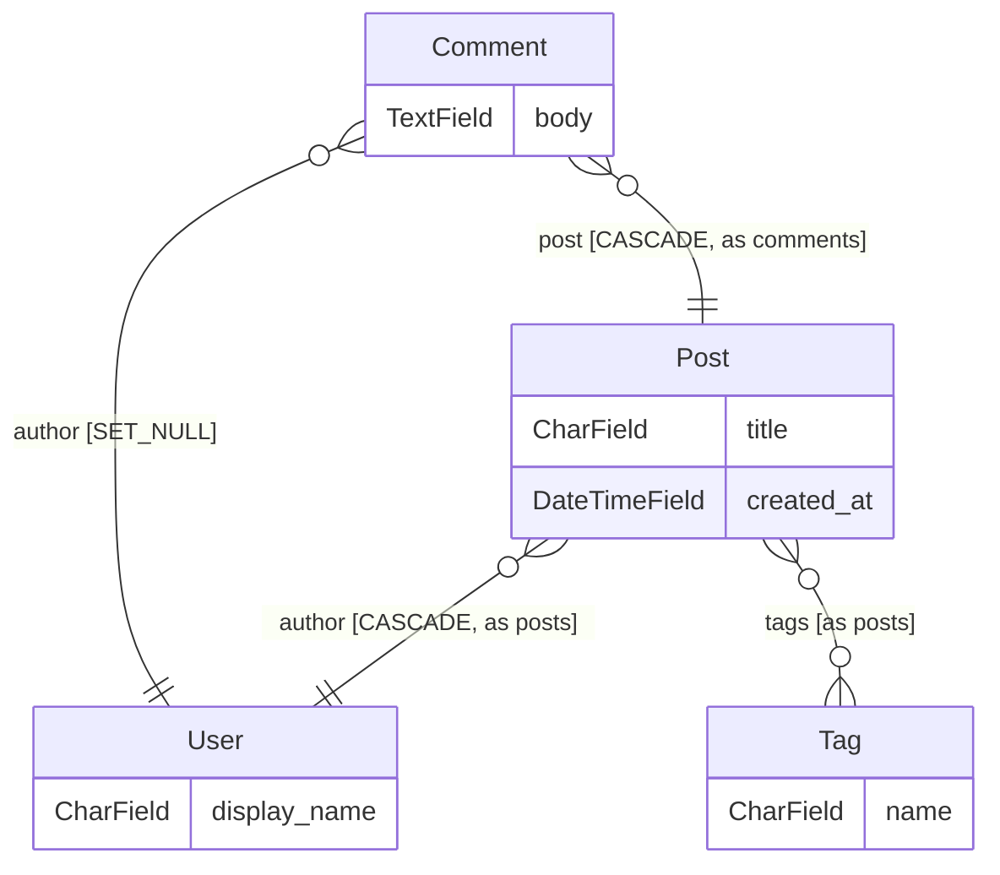

**[English](../../README.md)** · Русский · [Español](README.es.md) · [中文](README.zh.md)

<div align="center" markdown="1">


<br/>
<br/>

# Django ORM Lens

### Слой schema intelligence для Django.

Весь ваш граф моделей — вживую в боковой панели редактора, на страже вашего CI и в ответах вашему AI-агенту через MCP. Всё это — из статического парсинга: без базы данных, без `runserver`, без рабочего venv.

**Заменяет:** `graph_models` + `django-schema-graph` + нарисованные от руки ER-диаграммы + grep-археологию.

<br/>

<!-- Hero — LIVE badges only, minimal (FastAPI / Rich pattern) -->

[](https://pypi.org/project/django-orm-lens/)
[](https://pypi.org/project/django-orm-lens/)
[](https://pypi.org/project/django-orm-lens/)
[](https://github.com/FROWNINGdev/django-orm-lens/actions/workflows/ci.yml)
[](https://pepy.tech/project/django-orm-lens)
[](../../LICENSE)

<br/>

<!-- One-click install per platform -->

[](https://marketplace.visualstudio.com/items?itemName=frowningdev.django-orm-lens)
[](https://open-vsx.org/extension/frowningdev/django-orm-lens)
[](https://github.com/FROWNINGdev/django-orm-lens/pkgs/container/django-orm-lens)

</div>

---

## ⚡ 10 секунд до первого инсайта

```bash
uvx django-orm-lens scan      # or: pipx run django-orm-lens scan
```

Холодный клон, сломанный venv, нет settings-модуля — вы всё равно получаете каждое приложение, модель, поле и связь проекта прямо у себя в терминале.

**Затем выберите свою поверхность** — три дистрибутива, одно ядро парсера:

| Кто вы | Установка | Что вы получаете |
|---|---|---|
| **Пользователь редактора** — VS Code / Cursor / Windsurf / VSCodium | `code --install-extension frowningdev.django-orm-lens` | Дерево в боковой панели, живая ER-диаграмма, hover-карточки, 16 QuickFix-правил |
| **Пользователь терминала / CI** | `pip install django-orm-lens` | 13 подкоманд, SARIF + PR-аннотации, pre-commit-хуки, GitHub Action |
| **Пользователь AI-агентов** — Cursor / Claude Code / Aider / Zed / Continue | `pip install "django-orm-lens[mcp]"` | 10 read-only MCP-инструментов, отвечающих на вопросы о схеме на основе ground truth |

Настройка MCP — один JSON-блок, см. [Интеграции](#-интеграции). Укажите в `DJANGO_ORM_LENS_ROOT` абсолютный путь к вашему Django-проекту.


---

## 🆓 Возможности платных тарифов — бесплатно и под MIT

Ревью схемы почти везде продаётся. Бот, который разбирает каждый пулл-реквест, анализ, который ведёт queryset за пределы функции, где он собран, проверка, ловящая расхождение схемы с миграциями, советы по индексам на основе реальной статистики таблиц — обычно всё это лежит за подпиской: за место в команде или за базу.

Здесь это есть целиком, под лицензией MIT: без тарифов, без счётчика мест, без аккаунта и без телеметрии.

| Возможность, которую обычно продают | Здесь |
|---|---|
| Бот ревью изменений схемы в PR — пишет один раз, дальше обновляет тот же комментарий | [`blast-radius`](../rules/blast-radius.md) + Action |
| Анализ, который ведёт queryset через границы функций | [`nplusone`](../rules/nplusone.md) |
| Детект расхождения схемы с миграциями | [`drift`](../rules/drift.md) |
| Предложения индексов по фактическому использованию QuerySet | `suggest-indexes` |
| Риск миграции с поправкой на реальный размер таблицы | `blast-radius --stats` |
| Радиус поражения разрушительной миграции | [`blast-radius`](../rules/blast-radius.md) |
| Что сломается, если убрать поле — по слоям Django | `impact` |

**Платного тарифа нет и не планируется.** Если инструмент сэкономил вам вечер — звезда и есть вся просьба.


---

## 📊 Трекшн

<div align="center" markdown="1">

<!-- Traction — LIVE counters only, no hardcoded numbers -->

[](https://github.com/FROWNINGdev/django-orm-lens/stargazers)
[](https://github.com/FROWNINGdev/django-orm-lens/network/members)
[](https://pypi.org/project/django-orm-lens/)
[](https://pepy.tech/project/django-orm-lens)
[](https://marketplace.visualstudio.com/items?itemName=frowningdev.django-orm-lens&ssr=false#review-details)
[](https://github.com/FROWNINGdev/django-orm-lens/graphs/contributors)
[](https://github.com/FROWNINGdev/django-orm-lens/commits/main)

<br/>

<!-- Directory presence — one row per registry, no duplicates -->

[](https://registry.modelcontextprotocol.io/)
[](https://smithery.ai/server/@frowningdev/django-orm-lens)
[](https://glama.ai/mcp/servers/FROWNINGdev/django-orm-lens)
[](https://github.com/punkpeye/awesome-mcp-servers)
[](https://mcp.so/servers/django-orm-lens)

</div>

> Если инструмент сэкономит вам один `grep`, когда вы в следующий раз откроете незнакомый Django-проект — **[звезда помогает другим найти его](https://github.com/FROWNINGdev/django-orm-lens/stargazers)**.

### 📈 Рост звёзд

<div align="center">
  <a href="https://www.star-history.com/?repos=FROWNINGdev%2Fdjango-orm-lens&type=date&legend=top-left">
    <picture>
      <source media="(prefers-color-scheme: dark)" srcset="https://api.star-history.com/chart?repos=FROWNINGdev/django-orm-lens&type=date&theme=dark&legend=top-left&sealed_token=Bt09MbOICQzMe0Yzud5Up9GEQwXZReJEx6n5AS5Sl2GB3UtfipcUjyojd3g8PEfAkOFiZgy5uJel_LoNeLy_r7I4pyGhnYdUyQIbJDQzKlx1oA3BLRkxlAgby995WLgF7Ze1fdg2TlS6EJH0aRozsCZnwP1rtqXbMCWRMu1c9qpFrPcKxgFNd1G9fWMT" />
      <source media="(prefers-color-scheme: light)" srcset="https://api.star-history.com/chart?repos=FROWNINGdev/django-orm-lens&type=date&legend=top-left&sealed_token=Bt09MbOICQzMe0Yzud5Up9GEQwXZReJEx6n5AS5Sl2GB3UtfipcUjyojd3g8PEfAkOFiZgy5uJel_LoNeLy_r7I4pyGhnYdUyQIbJDQzKlx1oA3BLRkxlAgby995WLgF7Ze1fdg2TlS6EJH0aRozsCZnwP1rtqXbMCWRMu1c9qpFrPcKxgFNd1G9fWMT" />
      
    </picture>
  </a>
</div>

---

## ⚡ Установка

**VS Code / Cursor / Windsurf** (VS Code Marketplace):

```bash
code --install-extension frowningdev.django-orm-lens
```

**VSCodium / code-server / Gitpod / любой OSS-форк Code** (Open VSX):

```bash
codium --install-extension frowningdev.django-orm-lens
```

Или найдите **`Django ORM Lens`** во вкладке Extensions — в обоих реестрах один и тот же издатель `frowningdev`.

**Терминал и AI-агенты для программирования:**

```bash
pip install django-orm-lens              # CLI only
pip install "django-orm-lens[mcp]"       # + MCP server for AI agents
```

Требуется Python 3.9+. У CLI ноль runtime-зависимостей.

**Docker (v0.6+):**

```bash
docker run --rm -v "$PWD:/workspace" ghcr.io/frowningdev/django-orm-lens scan --path .
```

Мультиарх (amd64 + arm64). Python на хосте не требуется. Хорош для CI и разовых аудитов.

<br/>

## 🎯 Проблема

> **Работает офлайн. Работает на сломанном venv. Работает на чужом ноутбуке. Работает в CI.**

Вы открываете Django-проект. В нём 20 приложений. Нужно ответить на простой вопрос:

> _«В каком приложении живёт модель `Order` и как она связана с `User`?»_

Сегодня это значит: `Ctrl+P`, «models», прокрутить 30 совпадений, открыть пять файлов, `Ctrl+F` по `class Order`, продраться через 400 строк со строками `ForeignKey('otherapp.Something')` и попытаться вспомнить, что вы узнали два файла назад.

**Полдня впустую. Каждый раз. На каждом проекте.**

<br/>

## ✨ С Django ORM Lens

<table>
<tr>
<td width="50%" valign="top">

### 📚 Дерево со всем сразу

Каждое приложение → каждая модель → каждое поле → каждая опция `Meta`. Сгруппировано по приложениям, отсортировано по алфавиту, разворачивается.

Иконки с первого взгляда отличают `CharField` от `ForeignKey` и от `ManyToManyField`.

</td>
<td width="50%" valign="top">

### 🕸️ Живая ER-диаграмма

Одной командой открывается Mermaid-диаграмма «сущность–связь» всей вашей схемы. Смотрите, как она перерисовывается по мере редактирования. Экспорт в SVG.

`ForeignKey`, `OneToOneField` и `ManyToManyField` превращаются в правильные стрелки с кардинальностями.

</td>
</tr>
<tr>
<td width="50%" valign="top">

### 🔎 Hover по связям

Наведите курсор на `ForeignKey('app.Model')` в любом Python-файле → всплывает карточка с полями целевой модели, её связями и ссылкой «Jump to». Никакого `Ctrl+F`, никаких диалогов выбора файла.

</td>
<td width="50%" valign="top">

### 🧭 Jump-to-definition

Клик по любому полю в дереве → курсор оказывается на нужной строке. Дерево фильтруется по имени приложения или модели. Полностью поддерживаются разнесённые пакеты `models/`.

</td>
</tr>
<tr>
<td width="50%" valign="top">

### ⚡ Нулевая настройка

Никакого `DJANGO_SETTINGS_MODULE`. Никакого `runserver`. `models.py` парсится статически. Работает со сломанным venv, отсутствующей зависимостью или на чужом ноутбуке.

</td>
<td width="50%" valign="top">

### 🎨 Нативный UI VS Code

Тёмная тема. Светлая тема. Ваша тема. Следует вашей теме иконок, вашему шрифту, вашим горячим клавишам. Ничего кричащего, никакого брендинга.

</td>
</tr>
</table>

<br/>

## 🚀 Продвинутые возможности

<table>
<tr>
<td width="50%" valign="top">

### 🎯 Инлайн-QuickFix (16 правил)

Статический анализ `.py`-файлов с кодами в стиле Ruff (`DOL001`..`DOL032`), `Applicability` в стиле Clippy и переопределением severity для каждого правила. `.count() > 0` → `.exists()`, `null=True` на `CharField`, отсутствующий `on_delete`, `datetime.now()` → `timezone.now()` и ещё дюжина.

Подавление прямо в коде: `# django-orm-lens-disable-next-line DOL007`.

</td>
<td width="50%" valign="top">

### 🧪 Генератор фабрик

Правый клик по любой модели → каркас `DjangoModelFactory` для `factory_boy` с Faker-провайдерами, подобранными по типу поля. `CharField(max_length)` масштабирует корзины числа слов, `DecimalField(N,D)` вычисляет `left_digits=N-D`, `choices=` отображается в `Iterator`, M2M получает `@post_generation`. FK-цепочки транзитивно подтягивают связанные фабрики.

Также доступно как CodeLens над каждым классом модели.

</td>
</tr>
<tr>
<td width="50%" valign="top">

### 🕰 Дифф схемы во времени (Time-Travel)

Выберите `models.py`, выберите два коммита — получите типизированный дифф в виде готового для PR markdown. События `AddModel` / `DropModel` / `RenameModel` / `ModifyModel` с детекцией переименований и оценкой уверенности (Левенштейн + Жаккар по форме полей).

Переименования — события первого класса, никогда не `Add + Drop`. LRU-кэш по blob-SHA — коммиты, не трогающие `models.py`, разделяют общий распарсенный снепшот.

</td>
<td width="50%" valign="top">

### 🔎 Анализ влияния

«Что сломается, если удалить это поле?» — правый клик по полю или модели → сканирование всей рабочей области с группировкой по слоям Django (models, serializers, forms, admin, views, urls, templates, tests, migrations).

Находки несут тег уверенности **Certain / Likely / Possibly**. Обрабатываются строковые ORM-ссылки (`order_by("-author")`), lookup'ы в kwargs (`filter(author__id=1)`), кортежи `Meta.fields` и переменные шаблонов.

</td>
</tr>
<tr>
<td width="50%" valign="top">

### ⚡ Интерактивный конструктор запросов

Правый клик по полю или модели → выбор шаблона → сниппет вставляется у курсора (с tab-стопами) или в новый untitled-буфер.

`.filter(field=?)` на FK автоматически дописывает `.select_related(...)`, `.annotate(post_count=Count('post_set'))` учитывает `related_name`, `.prefetch_related` для M2M, `.values('field').distinct()`, `.only('field')`.

</td>
<td width="50%" valign="top">

### 🎨 Переработка UX боковой панели

Стабильный `TreeItem.id` — обновление больше не сворачивает дерево. Богатые тултипы `MarkdownString` с deep-ссылками `command:`. Бейдж на панели активности считает DOL###-замечания.

Бейджи `FileDecorationProvider`: красный `!` на FK без `on_delete`, жёлтый `~` на строковых полях с `null=True` (поднимается до родительской строки модели, в стиле Git).

</td>
</tr>
</table>

<br/>

## 📸 Как это выглядит

<div align="center" markdown="1">

</div>

**Живой пример** — настоящий вывод `django-orm-lens er`, GitHub рендерит его прямо здесь:



**Также входит в расширение:**

- 🕸️ **Живая ER-диаграмма** — стрелки кардинальностей Mermaid, подписи на рёбрах (`CASCADE`, `through Model`, `as related_name`), учёт темы, экспорт в SVG одним кликом
- 🔎 **Hover-карточки** — над любым `ForeignKey('app.Model')` или `ManyToManyField(...)`, со ссылкой для перехода одним кликом
- 🧭 **CodeLens** — над каждой строкой `class Model`: количество полей, количество связей и действие **Open ER diagram**
- 🎨 **Именованные темы** — `auto` / `default` / `dark` / `forest` / `neutral` для webview с диаграммой

<br/>

## 🤖 Для терминалов и AI-агентов программирования

Тот же парсер, что стоит в основе расширения для VS Code, поставляется как отдельный Python-пакет — с опциональным **MCP-сервером (Model Context Protocol)**, чтобы любой MCP-совместимый AI-агент мог перемещаться по вашей Django-схеме, не импортируя Django и не поднимая приложение.

### CLI

```bash
django-orm-lens scan -f json                 # every app, every model, every field
django-orm-lens describe blog.Post           # one model in Markdown
django-orm-lens list | fzf                   # flat app.Model — pipes anywhere
django-orm-lens er > schema.mmd              # ER diagram — Mermaid (default)
django-orm-lens er -f dbml > schema.dbml     # …or DBML: paste into dbdiagram.io
django-orm-lens er -f d2 > schema.d2         # …or D2 / plantuml
django-orm-lens diff before.json after.json  # what a PR changes structurally
django-orm-lens nplusone --format github     # N+1 findings as PR annotations
django-orm-lens migration-risk -f sarif      # SARIF for GitHub Code Scanning
django-orm-lens suggest-indexes blog.Post    # Meta.indexes proposals from usage
django-orm-lens signals                      # sender→signal→handler graph
django-orm-lens migration-deps blog -f mermaid   # per-app migration DAG
django-orm-lens cascade blog.Author          # what one delete() takes down
```

Каждая команда принимает `--path <dir>` и `--exclude <glob>`. `nplusone` / `migration-risk` / `diff` выходят с кодом `1` при находках — добавьте их в CI, чтобы блокировать PR при регрессиях.

### MCP-сервер

Зарегистрируйте его один раз в своём агенте — и он предоставит десять read-only инструментов:

| Инструмент | Назначение |
| --- | --- |
| `list_apps` | Каждое Django-приложение в рабочей области с числом моделей |
| `list_models` | Плоский список `app.Model`, опциональный фильтр по приложению |
| `describe_model` | Полная детализация полей / связей / Meta одной модели |
| `find_relations` | Входящие и исходящие связи одной модели |
| `cascade_preview` | Радиус поражения одного `delete()`, с группировкой по `on_delete` |
| `er_diagram` | ER-диаграмма — `mermaid` / `dbml` / `d2` / `plantuml` |
| `describe_migration_dependency` | DAG миграций по приложениям: корни, листья, зависимости между приложениями |
| `suggest_indexes` | Предложения `Meta.indexes` на основе наблюдаемого использования QuerySet |
| `signal_graph` | Граф sender→signal→handler из декораторов `@receiver` |
| `nplusone_scan` | Статические N+1-находки для всей рабочей области |

```bash
# Start it directly
django-orm-lens-mcp

# Or via the CLI subcommand
django-orm-lens mcp
```

**Разрешение рабочей области (py-1.3.0+).** Каждый инструмент принимает опциональный аргумент `workspace_root` прямо в вызове. Приоритет разрешения: явный аргумент → `$DJANGO_ORM_LENS_ROOT` → текущая рабочая директория. Невалидные или не-Django пути возвращают структурированный конверт (`{"error": "WORKSPACE_NOT_DJANGO", "hint": "…"}`) вместо пустых результатов, так что агент может сам себя скорректировать. Опциональная песочница через `DJANGO_ORM_LENS_ALLOWED_ROOTS` (разделитель — `;` на Windows, `:` в остальных системах).

<br/>

## 🛡️ Защитите свой CI

Регрессии схемы дешевле всего ловить в момент, когда они попадают в PR. Три способа заблокировать их без настройки:

**pre-commit** — два хука, локально ничего ставить не нужно:

```yaml
# .pre-commit-config.yaml
repos:
  - repo: https://github.com/FROWNINGdev/django-orm-lens
    rev: py-v1.7.0
    hooks:
      - id: django-orm-lens-nplusone
      - id: django-orm-lens-migration-risk
```

**GitHub Action** — находки появляются как PR-аннотации, без единого дополнительного разрешения:

```yaml
- uses: FROWNINGdev/django-orm-lens@action-v1
  with:
    command: migration-risk      # or: nplusone
    format: github               # ::error / ::warning annotations on the diff
```

**SARIF → Code Scanning** — находки попадают во вкладку Security репозитория:

```yaml
- run: |
    pip install django-orm-lens
    django-orm-lens migration-risk --format sarif --exit-zero > lens.sarif
- uses: github/codeql-action/upload-sarif@v3
  with:
    sarif_file: lens.sarif
```

Коды выхода нативны для CI: `diff` и `nplusone` выходят с `1` при находках, `migration-risk` — с `1` при критических находках. Добавьте `--exit-zero` для режима «только отчёт».

<br/>

## 🔌 Интеграции

| Клиент | Как подключить | Статус |
|---|---|:-:|
| **VS Code** | `code --install-extension frowningdev.django-orm-lens` | ✅ |
| **Cursor** | тот же VSIX + опциональная MCP-запись в `~/.cursor/mcp.json` | ✅ |
| **Windsurf / VSCodium / любой форк Code** | установите VSIX с [Marketplace](https://marketplace.visualstudio.com/items?itemName=frowningdev.django-orm-lens) или из [GitHub Releases](https://github.com/FROWNINGdev/django-orm-lens/releases) | ✅ |
| **Aider** | добавьте `django-orm-lens-mcp` в свой `mcp.json` | ✅ (через MCP) |
| **Continue.dev** | зарегистрируйте MCP-сервер в `~/.continue/config.json` | ✅ (через MCP) |
| **Zed** | зарегистрируйте MCP-сервер в настройках Zed | ✅ (через MCP) |
| **Любой MCP-совместимый клиент** | укажите в `command` путь к `django-orm-lens-mcp`, задайте `DJANGO_ORM_LENS_ROOT` | ✅ |
| **pre-commit** | `repo: https://github.com/FROWNINGdev/django-orm-lens` + два id хуков | ✅ |
| **GitHub Actions** | `uses: FROWNINGdev/django-orm-lens@action-v1` — аннотации или SARIF | ✅ |
| **Виден в [MCP Registry](https://registry.modelcontextprotocol.io/)** | официальный каталог серверов Model Context Protocol | ✅ |
| **Обычный терминал / CI** | `pip install django-orm-lens && django-orm-lens scan` | ✅ |

### Пример: Cursor / любой MCP-клиент

```jsonc
{
  "mcpServers": {
    "django-orm-lens": {
      "command": "django-orm-lens-mcp",
      "env": { "DJANGO_ORM_LENS_ROOT": "/abs/path/to/your/project" }
    }
  }
}
```

<br/>

## ⚡ Производительность

Регрессионный набор парсит вендоренные графы моделей **Zulip, Saleor, Wagtail, django CMS и Mezzanine** — 59 моделей на 13 478 строк реального `models.py` — примерно за **20 мс** end-to-end на ноутбуке (21 мс best-of-3 на корпусе golden-фикстур репозитория; в CI на каждой ячейке матрицы выполняется страховочная проверка `<2 s`).

Воспроизведите это сами:

```bash
git clone https://github.com/FROWNINGdev/django-orm-lens && cd django-orm-lens/cli
pip install -e . && python -m pytest tests/test_golden_fixtures.py tests/test_golden_snapshots.py -q
```

<br/>

## 🎯 Для кого это

- **Django-разработчики**, попадающие в кодовую базу с 10+ приложениями и теряющиеся в разросшемся `models.py`.
- **Контрактники и фрилансеры**, которым нужно охватить незнакомый Django-проект за первый час, а не за первую неделю.
- **Команды при онбординге новых сотрудников**, желающие видеть схему одним взглядом без разворачивания инфраструктуры документации.
- **Продвинутые пользователи AI-агентов** (Cursor / Aider / Zed / Continue / любой MCP-совместимый клиент), которым нужно, чтобы агент точно отвечал на вопросы о схеме — не получая учётных данных БД и не запуская Django.
- **CI-пайплайны**, проверяющие форму схемы (например, «не сломали ли мы случайно `related_name`?»), не импортируя проект.
- **Соло-инди-разработчики** на сломанном venv или чужом ноутбуке — без `runserver`, без `manage.py migrate`, всё равно работает.

<br/>

## 🗺️ Позиционирование на рынке

Django ORM Lens находится на пересечении **инструментов для редакторов** и **инструментов для AI-агентов** — в нише, которую не закрывает ни один существующий пакет:

| Сегмент | Существующий вариант | Чего это вам стоит |
|---|---|---|
| Boot-and-graph | `django-extensions graph_models` | Требует Graphviz + настройки Django + рабочий URL БД |
| Веб-вьюер | `django-schema-graph` | Требует запущенный Django-сервер; ещё одна вещь, которая может сломаться |
| Админка | Django Admin | Требует runserver + аутентификацию + базу данных — отлично для данных, не для архитектуры |
| Плагин к редактору | Django Structure в PyCharm | Привязан к PyCharm; нет CLI, нет истории с AI-агентами |
| MCP-сервер | (до сих пор — ничего) | AI-агенты угадывают вашу схему по исходникам, с ошибками |

**Django ORM Lens — единственный инструмент, поставляющий три поверхности из одного парсера:** расширение для VS Code (любой форк Code), CLI без зависимостей (терминалы + CI) и MCP-сервер (AI-агенты). Всё статически. Всё бесплатно. Всё под MIT.

<br/>

## 🤔 Чем это отличается?

| | **Django ORM Lens** | `django-extensions graph_models` | `django-schema-graph` | Django Admin | PyCharm Django Structure |
|---|:-:|:-:|:-:|:-:|:-:|
| Работает без загружаемого Django-проекта | ✅ | ❌ | ❌ | ❌ | ⚠️ |
| Zero-install (без graphviz, без сервера) | ✅ | ❌ | ❌ | ❌ | ❌ (нужен PyCharm) |
| Работает в VS Code / Cursor / любом форке Code | ✅ | ❌ | ❌ | ❌ | ❌ |
| Дерево в боковой панели редактора | ✅ | ❌ | ❌ | ❌ | ✅ |
| Живая ER-диаграмма | ✅ | ✅ | ✅ | ❌ | ❌ |
| Hover-карточки на `ForeignKey` | ✅ | ❌ | ❌ | ❌ | ⚠️ |
| CodeLens над классами моделей | ✅ | ❌ | ❌ | ❌ | ❌ |
| Поддержка разнесённого пакета `models/` | ✅ | ⚠️ | ⚠️ | ✅ | ✅ |
| CLI для терминала / CI | ✅ | ⚠️ | ❌ | ❌ | ❌ |
| MCP-сервер для AI-агентов | ✅ | ❌ | ❌ | ❌ | ❌ |
| Виден в [MCP Registry](https://registry.modelcontextprotocol.io/) | ✅ | ❌ | ❌ | ❌ | ❌ |
| Бесплатный и open-source (MIT) | ✅ | ✅ | ✅ | ✅ | ❌ (платная IDE) |
| Поддержка версий Django | **4.0 – 5.2** | последняя | 3.2 – 4.1 (не обновляется с 2023) | последняя | последняя |

> *`django-schema-graph` не обновлялся с 2023-05 и не тестирует Django 5.x.*

### Когда вам нужно что-то другое

Честные границы: профилирование живого запроса → **django-debug-toolbar**. Историческое профилирование запросов → **django-silk**. Проверки числа запросов в тестовом наборе → **django-perf-rec**. Продакшен-APM на реальном трафике → **Scout / Sentry**. Django ORM Lens сознательно остаётся статическим — это слой, который работает ещё до того, как приложение вообще способно загрузиться, и единственный, которым ваш CI и ваш AI-агент могут пользоваться на любом чекауте.

<br/>

## ⚙️ Конфигурация

Дефолты продуманы и разумны. Если нужно подкрутить:

```jsonc
// .vscode/settings.json
{
  "djangoOrmLens.excludeGlobs": [
    "**/migrations/**",
    "**/node_modules/**",
    "**/venv/**",
    "**/.venv/**",
    "**/env/**"
  ],
  "djangoOrmLens.autoRefresh": true
}
```

| Настройка | Тип | По умолчанию | Что делает |
|---|---|---|---|
| `djangoOrmLens.excludeGlobs` | `string[]` | См. выше | Glob-паттерны, пропускаемые при сканировании |
| `djangoOrmLens.autoRefresh` | `boolean` | `true` | Повторное сканирование при изменениях `models.py` |
| `djangoOrmLens.codeFixes.enabled` | `boolean` | `true` | Главный переключатель диагностик DOL### + QuickFix |
| `djangoOrmLens.rules` | `object` | `{}` | Severity для каждого правила: `{ "DOL007": "off", "DOL013": "error" }` |
| `djangoOrmLens.rulesSelect` | `string[]` | `[]` | Select в стиле Ruff. `["DOL0"]` запускает только правила queryset+model |
| `djangoOrmLens.rulesIgnore` | `string[]` | `[]` | Ignore в стиле Ruff. `["DOL03"]` глушит правила form/view |

<br/>

## 🔬 Каталог правил

Шестнадцать проверок на стороне редактора (`DOL001`–`DOL032`) с кодами в стиле Ruff, severity для каждого правила и applicability в стиле Clippy — плюс пятнадцать CLI-правил рисков миграций и статический N+1-анализатор. **У каждого правила теперь есть своя страница документации.**

| Категория | Правила | Примеры |
|---|---|---|
| [Queryset](../rules/README.md) | `DOL001`–`DOL007` | `.count() > 0` → `.exists()`, доступ к FK в циклах (N+1) |
| [Определение модели](../rules/README.md) | `DOL011`–`DOL015` | `ForeignKey` без `on_delete`, `null=True` на строковых полях |
| [Datetime](../rules/README.md) | `DOL021`–`DOL022` | `datetime.now()` → `timezone.now()` |
| [Формы / представления](../rules/README.md) | `DOL031`–`DOL032` | `locals()` в `render()`, `Meta.fields = '__all__'` |
| [Риски миграций](../rules/migrations.md) | 16 правил | Добавление NOT NULL без default, блокирующие таблицу построения индексов, необратимые data-миграции |
| [Статический N+1](../rules/nplusone.md) | 1 анализатор | Доступ к FK/M2M в циклах без `select_related` / `prefetch_related` |

→ **[Полный справочник правил](../rules/README.md)** — каждый код с примерами «плохо/хорошо», поведением QuickFix и синтаксисом подавления.

### Подавление прямо в коде

```python
# django-orm-lens-disable-next-line DOL007
for user in User.objects.all():
    print(user.profile)  # not flagged

qs.count() > 0  # django-orm-lens-disable-line DOL001

# django-orm-lens-disable DOL011  ← on its own line, kills DOL011 for the rest of the file
```

Applicability следует модели Clippy из Rust: **safe**-фиксы могут применяться автоматически («Fix All»), **suggestion**-фиксы предлагаются как QuickFix, но проходят ревью, **unsafe**-находки никогда не применяются автоматически. Фиксы отделены от анализаторов (в стиле Roslyn), поэтому одно правило может со временем обрасти несколькими фиксерами, не трогая логику детекции.

<br/>

## 🧭 Команды

Откройте палитру команд (`Ctrl+Shift+P` / `Cmd+Shift+P`) и введите «Django ORM Lens»:

| Команда | Что делает |
|---|---|
| `Django ORM Lens: Refresh` | Принудительное пересканирование рабочей области |
| `Django ORM Lens: Show ER Diagram` | Открыть Mermaid ER-диаграмму рядом с кодом |
| `Django ORM Lens: Filter Models` | Отфильтровать дерево по имени приложения / модели / поля |
| `Django ORM Lens: Clear Filter` | Восстановить полное дерево |
| `Django ORM Lens: Jump to Model` | Программная — вызывается кликами по дереву и hover-карточками |
| `Django ORM Lens: Find Reverse References` | Правый клик по модели — QuickPick всех FK, указывающих на неё |
| `Django ORM Lens: Generate factory_boy Factory` | Правый клик по модели или CodeLens — сгенерировать каркас `DjangoModelFactory` |
| `Django ORM Lens: Schema Diff (Time-Travel)` | Выберите два коммита — получите типизированный дифф в markdown-буфере |
| `Django ORM Lens: Find Impact (What Uses This?)` | Правый клик по полю или модели — поиск ссылок по всей рабочей области |
| `Django ORM Lens: Build Query (Insert Snippet)` | Правый клик по полю или модели — выбор ORM-шаблона |

<br/>

## 🗺️ Дорожная карта

**Выпущено**

- [x] Дерево в боковой панели, сгруппированное по приложениям
- [x] Живая Mermaid ER-диаграмма
- [x] Hover-карточки над `ForeignKey('app.Model')`
- [x] Фильтр дерева по имени
- [x] Поддержка разнесённого пакета `models/`
- [x] Экспорт ER-диаграммы в SVG
- [x] Python CLI + MCP-сервер для терминалов и AI-агентов
- [x] Welcome-вью для пустых рабочих областей
- [x] Безопасный по путям jump-to-definition и санитизированный hover-markdown
- [x] **v0.3.0** — CodeLens над каждым классом модели (`N fields · N relations · Open ER diagram`)
- [x] **v0.3.0** — Подписи на рёбрах диаграммы (`CASCADE`, `SET_NULL`, `PROTECT`, `related_name`)
- [x] **v0.3.0** — Именованные цветовые темы (`auto` / `default` / `dark` / `forest` / `neutral`)
- [x] **v0.3.1** — `through_model` на M2M-рёбрах (вклад — [@kingrubic](https://github.com/kingrubic))
- [x] **v0.3.1** — Добавлен в [официальный MCP Registry](https://registry.modelcontextprotocol.io/) + [Glama.ai](https://glama.ai/mcp/servers/FROWNINGdev/django-orm-lens)
- [x] **v0.6.0** — CLI `nplusone` — статический детектор N+1 (доступ к FK/M2M внутри циклов без `select_related`/`prefetch_related`)
- [x] **v0.6.0** — CLI `migration-risk` — помечает рискованные операции в `migrations/*.py` (на сегодня 15 правил)
- [x] **v0.6.0** — CLI `diff` — сравнение двух JSON-дампов схемы для ревью PR
- [x] **v0.6.0** — Миникарта ER-диаграммы раскрашивает узлы по Django-приложениям
- [x] **v0.6.0** — Переводы README: 🇷🇺 русский, 🇪🇸 испанский, 🇨🇳 китайский
- [x] **v0.6.0** — Docker-образ на GHCR: `docker run ghcr.io/frowningdev/django-orm-lens`
- [x] **v0.7.0** — `settings.AUTH_USER_MODEL` разрешается везде: обратные связи в n+1, отправители сигналов, Mermaid ER, webview VS Code, панель входящих связей, React ER
- [x] **v0.7.0** — Парсер полей на AST: `ForeignKey(on_delete=CASCADE, to='User')` разрешается независимо от порядка kwargs (паритет Python + TS)
- [x] **v0.7.0** — Публичные общие хелперы: `find_user_model`, `resolve_related_tail`, `find_model`, `iter_workspace_py_files` (Python) + `findUserModel`, `resolveRelatedTail` (TS)
- [x] **v0.7.0** — `--verbose` больше не обходит дерево дважды; счётчик хранится в `WorkspaceIndex.scanned_files`
- [x] **v0.7.3** — Аннотации типов PEP-526 на полях (`jti: CharField[str] = models.CharField(...)`) теперь парсятся — сообщил [@jsabater](https://github.com/jsabater) ([#25](https://github.com/FROWNINGdev/django-orm-lens/issues/25)) с чистым репро на Django Ninja 1.6
- [x] **v0.7.4** — Генерик-заголовки классов PEP-695 (Python 3.12+): `class Container[T](models.Model):` теперь парсится
- [x] **v0.7.5** — Модуль models под алиасом (`from django.db import models as m`) и сторонние пакеты полей (`jsonfield.JSONField`) теперь распознаются
- [x] **v0.7.6** — Тела моделей с отступами табами теперь парсятся (редакторы с табами по умолчанию больше не показывают пустые модели)
- [x] **v0.8.0** — Инлайн-QuickFix: 16 правил (`DOL001`..`DOL032`) с severity для каждого правила + select/ignore в стиле Ruff + инлайновый `# django-orm-lens-disable-next-line`
- [x] **v0.8.0** — Генератор фабрик: каркас `factory_boy` из любой модели с Faker-провайдерами по типу поля
- [x] **v0.8.0** — Time-Travel Schema Diff: выберите два коммита → типизированный markdown-дифф с полноценной детекцией переименований
- [x] **v0.8.0** — Анализ влияния: сканирование ссылок на поле по всей рабочей области через все слои Django с тегами уверенности Certain/Likely/Possibly
- [x] **v0.8.0** — Интерактивный конструктор запросов: правый клик → шаблон → сниппет у курсора, с учётом грамматики (FK получает `.select_related`, `related_name` учитывается)
- [x] **v0.8.0** — Переработка UX боковой панели: стабильный `TreeItem.id`, тултипы `MarkdownString` с deep-ссылками `command:`, бейджи `FileDecorationProvider`, `TreeView.badge` на панели активности, три состояния `viewsWelcome` с when-условиями

**Не выпущено (в `main`)**

- [x] CI-форматы: SARIF 2.1.0 + PR-аннотации `--format github` для `nplusone` и `migration-risk`
- [x] Четыре анализатора переведены из MCP-only в CLI: `suggest-indexes`, `signals`, `migration-deps`, `cascade`
- [x] `er --format dbml | d2 | plantuml` — экспорт диаграмм в общепринятых форматах (dbdiagram.io, D2, PlantUML)
- [x] Три новых правила рисков миграций: `runpython_no_reverse`, `alter_unique_together_lock`, `alter_index_together_deprecated` — всего 15
- [x] pre-commit-хуки (`django-orm-lens-nplusone`, `django-orm-lens-migration-risk`) + composite GitHub Action
- [x] `docs/rules/` — страница документации для каждого правила (19 страниц)
- [x] Регрессионный набор golden-снепшотов на 59 реальных моделях (Zulip / Saleor / Wagtail / django CMS / Mezzanine); ruff + mypy теперь обязательны в CI
- [x] Граф зависимостей миграций — `migration-deps` (text / json / mermaid)

**Ближайшее**

- [ ] Автодополнение ORM-запросов внутри `.filter()` / `.exclude()` / `.annotate()` ([#3](https://github.com/FROWNINGdev/django-orm-lens/issues/3))
- [ ] Чекбоксы включения/выключения приложений и моделей, чтобы разгрузить огромные схемы
- [ ] Движок DOL-правил, портированный в Python CLI — один каталог правил, три поверхности

**Позже**

- [ ] Поддержка сторонних полей (`django-mptt`, `django-taggit`, `django-model-utils`)
- [ ] Плагин для JetBrains / PyCharm (если будет спрос)

Голосуйте, ставя 👍 на соответствующий [issue](https://github.com/FROWNINGdev/django-orm-lens/issues).

<br/>

## ❓ FAQ

<details>
<summary><b>Отправляете ли вы мой код на сервер?</b></summary>
<br/>
Нет. Каждый байт остаётся на вашей машине. Парсер — это чистый TypeScript (расширение) или чистый Python (CLI). Никаких вызовов LLM, никакой телеметрии, никакой аналитики, никаких отчётов об ошибках. Mermaid-рендерер работает внутри sandbox-webview VS Code.
</details>

<details>
<summary><b>Работает ли это с Poetry / uv / conda / вообще без venv?</b></summary>
<br/>
Да. Расширение читает исходники Python напрямую — оно не импортирует Django, и ему всё равно, каким пакетным менеджером вы пользуетесь. CLI требует Python 3.9+ — и это всё.
</details>

<details>
<summary><b>Мои модели разбиты по нескольким файлам внутри пакета <code>models/</code>. Это поддерживается?</b></summary>
<br/>
Да, начиная с v0.2.0. И расширение, и CLI обходят <code>models/*.py</code> наряду с классическим <code>models.py</code>.
</details>

<details>
<summary><b>Можно ли использовать это с DRF-сериализаторами, Wagtail, Oscar или сторонними базовыми моделями?</b></summary>
<br/>
Подхватывается любой класс, похожий на Django-модель: подклассы <code>models.Model</code>, абстрактные базы, начинающиеся с <code>Abstract</code>, распространённые миксины, оканчивающиеся на <code>Mixin</code>, и известные базовые имена вроде <code>TimeStampedModel</code> или <code>PolymorphicModel</code>. Классы, не являющиеся моделями (<code>ModelAdmin</code>, <code>ModelSerializer</code>, <code>Form</code>, <code>View</code>, <code>Manager</code>, …), отфильтровываются.
</details>

<details>
<summary><b>Какие AI-агенты могут использовать MCP-сервер?</b></summary>
<br/>
Любой MCP-совместимый клиент — Cursor, Aider, Continue.dev, Zed и любой другой инструмент, говорящий на этом протоколе. Просто укажите в <code>command</code> путь к установленному бинарнику <code>django-orm-lens-mcp</code>. См. раздел <a href="#-интеграции">Интеграции</a>.
</details>

<details>
<summary><b>Как заблокировать регрессии схемы в CI?</b></summary>
<br/>
Три способа, все без настройки: два <a href="#%EF%B8%8F-защитите-свой-ci">pre-commit-хука</a>, composite GitHub Action (<code>uses: FROWNINGdev/django-orm-lens@action-v1</code> с <code>format: github</code> для PR-аннотаций) или <code>--format sarif</code>, направленный в <code>github/codeql-action/upload-sarif</code> для вкладки Security. <code>diff</code> / <code>nplusone</code> выходят с кодом 1 при находках, <code>migration-risk</code> — с кодом 1 при критических находках.
</details>

<details>
<summary><b>Есть ли версия для JetBrains / PyCharm?</b></summary>
<br/>
Пока нет. Окно Django Structure в PyCharm уже само по себе хорошее, поэтому дельта ценности меньше. Если попросит достаточно людей — это станет оправданным.
</details>

<br/>

## 🆘 Поддержка

- 🐛 **Баг-репорты** — [GitHub Issues](https://github.com/FROWNINGdev/django-orm-lens/issues) (пожалуйста, приложите минимальный сниппет `models.py`)
- 💡 **Запросы фич / идеи** — [GitHub Discussions](https://github.com/FROWNINGdev/django-orm-lens/discussions)
- 📝 **Отзывы в Marketplace** — [оцените расширение](https://marketplace.visualstudio.com/items?itemName=frowningdev.django-orm-lens&ssr=false#review-details) (самый быстрый сигнал, который двигает проект вперёд)
- 🐍 **Страница на PyPI** — [pypi.org/project/django-orm-lens](https://pypi.org/project/django-orm-lens/)
- 💚 **Спонсорство** — [github.com/sponsors/FROWNINGdev](https://github.com/sponsors/FROWNINGdev)

<br/>

## 📜 Лицензия

MIT © [FROWNINGdev](https://github.com/FROWNINGdev)

<br/>

<div align="center" markdown="1">

**Сделано для разработчиков, которым небезразлична их кодовая база.**

[Marketplace](https://marketplace.visualstudio.com/items?itemName=frowningdev.django-orm-lens) · [PyPI](https://pypi.org/project/django-orm-lens/) · [GitHub](https://github.com/FROWNINGdev/django-orm-lens) · [Issues](https://github.com/FROWNINGdev/django-orm-lens/issues) · [Discussions](https://github.com/FROWNINGdev/django-orm-lens/discussions) · [Sponsor](https://github.com/sponsors/FROWNINGdev)

</div>
